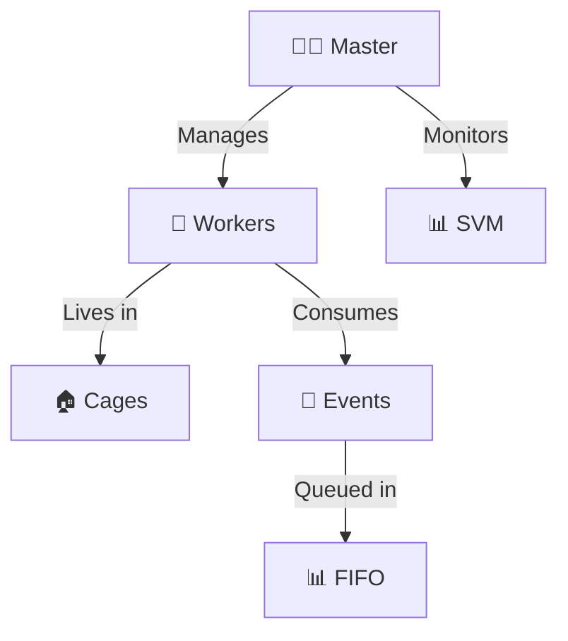
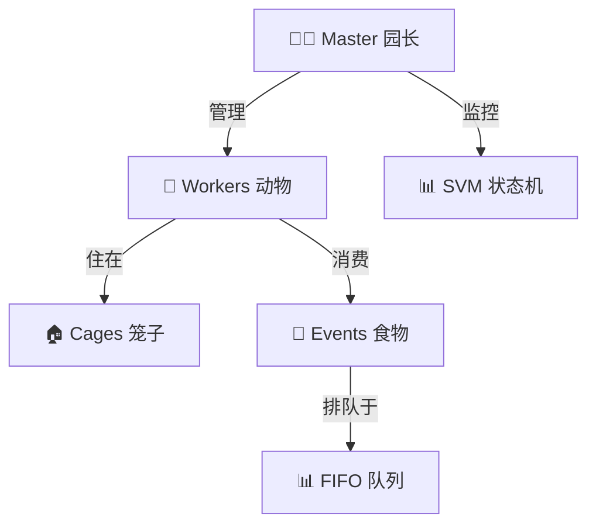

<div align="center">


# 🎪 Zoo Framework

**A simple and quick multi-threaded Python framework with zoo metaphor**

[](https://www.python.org/)
[](https://pypi.org/project/zoo-framework/)
[](LICENSE)
[](https://github.com/YearsAlso/zoo-framework/actions)
[](https://codecov.io/gh/YearsAlso/zoo-framework)

[English](#english) | [中文](#中文)

</div>

---

<a name="english"></a>
## 🇬🇧 English

### 🎯 What is Zoo Framework?

Zoo Framework is a Python multi-threaded framework based on the **zoo metaphor**. It provides an intuitive way to manage concurrent tasks through familiar concepts:

| Concept | Real World | Framework Component |
|---------|------------|---------------------|
| 🦁 **Worker** | Animals | Task execution units |
| 🏠 **Cage** | Cages | Thread-safe containers |
| 👨‍🌾 **Master** | Zookeeper | Framework manager |
| 🍎 **Event** | Food | Inter-worker communication |
| 🥘 **FIFO** | Feeder queue | Event management |

### ✨ Features

- 🔄 **Multi-threaded Execution** - Efficient concurrent task processing
- 🔄 **State Machine** - Powerful state management with persistence
- 📢 **Event System** - Flexible publish-subscribe messaging
- 🔌 **Plugin System** - Extensible architecture for third-party plugins
- 🏠 **Thread Safety** - Automatic thread-safe wrappers
- 📊 **Health Monitoring** - SVM (State Vector Machine) worker monitoring
- 🚀 **Async Support** - Native asyncio integration
- 📝 **Structured Logging** - JSON-formatted logs with metrics

### 📦 Installation

```bash
# From PyPI
pip install zoo-framework

# Or with all optional dependencies
pip install zoo-framework[dev,docs]
```

### 🚀 Quick Start

```python
from zoo_framework.core import Master
from zoo_framework.workers import BaseWorker
from zoo_framework.core.aop import cage

@cage  # Thread-safe wrapper
class MyWorker(BaseWorker):
    """🦁 Your first animal in the zoo!"""
    
    def __init__(self):
        super().__init__({
            "is_loop": True,      # Loop execution
            "delay_time": 1.0,    # Execute every 1 second
            "name": "MyWorker"
        })
        self.counter = 0
    
    def _execute(self):
        ""️⃣ Execute business logic"""
        self.counter += 1
        print(f"🎪 Hello from MyWorker! Count: {self.counter}")

# Start the zoo
if __name__ == "__main__":
    master = Master()
    master.run()
```

### 🏗️ Architecture



### 📚 Documentation

- [Development Guide](docs/DEVELOPMENT.md) - Setup development environment
- [Architecture](docs/ARCHITECTURE.md) - Framework architecture
- [Contributing](docs/CONTRIBUTING.md) - How to contribute
- [API Reference](docs/API_REFERENCE.md) - API documentation

### 🤝 Contributing

We welcome contributions! Please see [Contributing Guide](docs/CONTRIBUTING.md) for details.

```bash
# Fork and clone
git clone https://github.com/YOUR_USERNAME/zoo-framework.git

# Setup development environment
pip install -e ".[dev]"
pre-commit install

# Run tests
pytest
```

### 📄 License

Apache License 2.0 © [XiangMeng](https://github.com/YearsAlso)

---

<a name="中文"></a>
## 🇨🇳 中文

### 🎯 Zoo Framework 是什么？

Zoo Framework 是一个基于**动物园隐喻**的 Python 多线程框架。它通过熟悉的概念提供直观的方式来管理并发任务：

| 概念 | 现实世界 | 框架组件 |
|------|----------|----------|
| 🦁 **Worker** | 动物 | 任务执行单元 |
| 🏠 **Cage** | 笼子 | 线程安全容器 |
| 👨‍🌾 **Master** | 园长 | 框架管理者 |
| 🍎 **Event** | 食物 | Worker 间通信 |
| 🥘 **FIFO** | 饲养员队列 | 事件管理 |

### ✨ 特性

- 🔄 **多线程执行** - 高效的并发任务处理
- 🔄 **状态机** - 强大的状态管理，支持持久化
- 📢 **事件系统** - 灵活的发布-订阅消息机制
- 🔌 **插件系统** - 可扩展的第三方插件架构
- 🏠 **线程安全** - 自动线程安全包装器
- 📊 **健康监控** - SVM（状态向量机）Worker 监控
- 🚀 **异步支持** - 原生 asyncio 集成
- 📝 **结构化日志** - 带指标的 JSON 格式日志

### 📦 安装

```bash
# 从 PyPI 安装
pip install zoo-framework

# 或安装所有可选依赖
pip install zoo-framework[dev,docs]
```

### 🚀 快速开始

```python
from zoo_framework.core import Master
from zoo_framework.workers import BaseWorker
from zoo_framework.core.aop import cage

@cage  # 线程安全包装器
class MyWorker(BaseWorker):
    """🦁 动物园里的第一只动物！"""
    
    def __init__(self):
        super().__init__({
            "is_loop": True,      # 循环执行
            "delay_time": 1.0,    # 每秒执行一次
            "name": "MyWorker"
        })
        self.counter = 0
    
    def _execute(self):
        """⚡ 执行业务逻辑"""
        self.counter += 1
        print(f"🎪 Hello from MyWorker! 计数: {self.counter}")

# 启动动物园
if __name__ == "__main__":
    master = Master()
    master.run()
```

### 🏗️ 架构



### 🎪 核心概念

#### 👷 Worker - 动物

Worker 是执行任务的基本单元，就像动物园里的动物：

```python
from zoo_framework.workers import BaseWorker

class LionWorker(BaseWorker):
    def __init__(self):
        super().__init__({
            "is_loop": True,
            "delay_time": 2.0,
            "name": "🦁 LionWorker"
        })
    
    def _execute(self):
        print("🦁 狮子正在巡视领地！")
```

#### 🏠 Cage - 笼子

Cage 提供线程安全和生命周期管理：

```python
from zoo_framework.core.aop import cage

@cage  # 把 Worker 放进安全的笼子里
class SafeWorker(BaseWorker):
    def _execute(self):
        # 线程安全的代码
        pass
```

#### 🔄 State Machine - 状态机

管理复杂的状态转换：

```python
from zoo_framework.statemachine import StateMachineManager

sm = StateMachineManager()
sm.create_state_machine("order")
sm.add_state("order", "pending")
sm.add_state("order", "paid")
sm.transition("order", "pending", "paid")
```

### 📚 文档

- [开发指南](docs/DEVELOPMENT.md) - 搭建开发环境
- [架构设计](docs/ARCHITECTURE.md) - 框架架构说明
- [贡献指南](docs/CONTRIBUTING.md) - 如何贡献代码
- [API 参考](docs/API_REFERENCE.md) - API 文档

### 🛠️ CLI 工具

```bash
# 创建简单对象
zfc --create simple_object

# 创建线程示例
zfc --thread demo
```

### 🤝 贡献代码

我们欢迎贡献！请查看[贡献指南](docs/CONTRIBUTING.md)了解详情。

```bash
# Fork 并克隆
git clone https://github.com/YOUR_USERNAME/zoo-framework.git

# 搭建开发环境
pip install -e ".[dev]"
pre-commit install

# 运行测试
pytest
```

### 📄 许可证

Apache License 2.0 © [XiangMeng](https://github.com/YearsAlso)

---

<div align="center">

🎪 **Happy Coding in the Zoo!** 🦁

</div>
