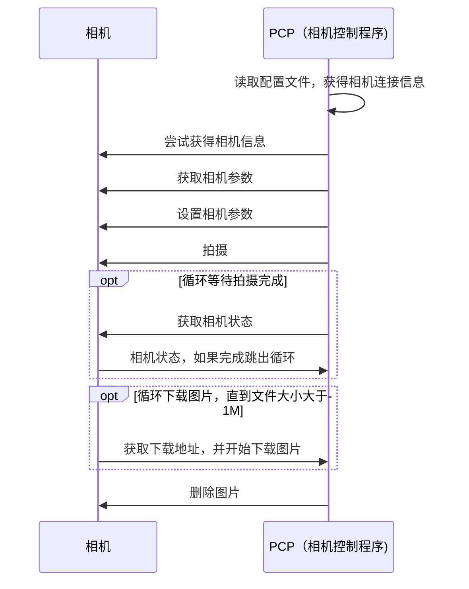
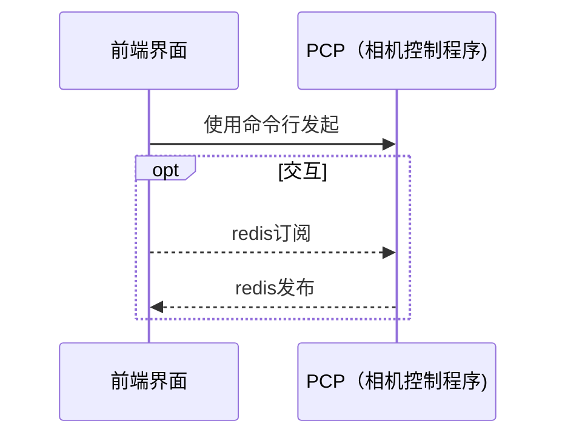
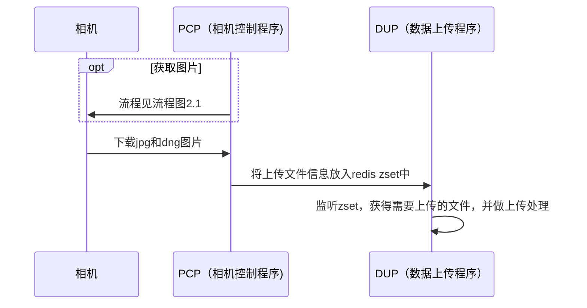

# 相机控制程序（PCP）说明文档

## 1.内饰相机基本信息：
**相机型号**：THETA Z1
**交互协议**：[THETA Web API v2.1](https://api.ricoh/docs/theta-web-api-v2.1/)
**开发语言**：python >= 3.6
**依赖环境**：redis
**相机模式**：client模式


## 2.交互流程图
#### 2.1 拍摄并获得结果


#### 2.2 软件界面交互



#### 2.3 采集多重拍摄结果




## 3.配置文件

#### 3.1 配置文件内容

```json
{
    "ssid": "THETAYN11100679",
    "password": "11100679",
    "photoAddr":"192.168.10.36",
    "bindNetwork": false,
    "needCompose": true,
    "options": {
        "captureMode": "image",
        "exposureProgram": 1,
        "iso": 80,
        "shutterSpeed": 0.06666666,
        "sleepDelay": 1800,
        "aperture": 5.6
    }
}
```


**ssid**：ap模式下为相机的wifi名称，cli模式下为相机认证的名称

**password**：ap模式下无效，cli模式下为认证密码

**photoAddr**：相机ip，ap模式下默认为192.168.1.1

**bindNetwork**： 通过ip绑定请求所使用的网卡

**needCompose**：是否需要合成


#### 3.2 配置文件路径

如果此路径不存在，程序会创建默认配置文件

*D:\FTPServer\Config\panophoto.json*


## 4.多重拍摄图像采集

#### 4.1 上传地址和内容
**目录**：els-pub-01/collection/PanoCamera/[时间戳]/ 

**Raw格式相片**：fuse_img1.DNG、fuse_img2.DNG、fuse_img3.DNG

**机出相片**：source_img.jpg

**拍摄信息**：info.json

**例图**：


[fuse_img1.DNG](https://els-pub-01.oss-cn-hangzhou.aliyuncs.com/collection/PanoCamera/1626674095/fuse_img1.DNG)

[fuse_img2.DNG](https://els-pub-01.oss-cn-hangzhou.aliyuncs.com/collection/PanoCamera/1626674095/fuse_img2.DNG)

[fuse_img3.DNG](https://els-pub-01.oss-cn-hangzhou.aliyuncs.com/collection/PanoCamera/1626674095/fuse_img3.DNG)


#### 4.2 拍摄参数

**fuse_img1.DNG：**

```python
{
    "exposureProgram": 1,
    "iso": 80,
    "shutterSpeed": 0.03333333,  # 快门速度 1/30
    "sleepDelay": 1800,
    "aperture": 5.6,
    "fileFormat": {"height": 3360, "type": "raw+", "width": 6720}
}
```


**fuse_img2.DNG：**

```python
{
    "exposureProgram": 1,
    "iso": 80,
    "shutterSpeed": 0.1,  # 快门速度 1/10
    "sleepDelay": 1800,
    "aperture": 5.6,
    "fileFormat": {"height": 3360, "type": "raw+", "width": 6720}
}
```


**fuse_img3.DNG：**

```python
{
    "exposureProgram": 1,
    "iso": 80,
    "shutterSpeed": 0.25,  # 快门速度 1/4
    "sleepDelay": 1800,
    "aperture": 5.6,
    "fileFormat": {"height": 3360, "type": "raw+", "width": 6720}
}
```


**source_img.jpg：**

```python
{
    "exposureProgram": 1,
    "iso": 80,
    "shutterSpeed": 0.06666666,  # 快门速度 1/15
    "sleepDelay": 1800,
    "aperture": 5.6,
    "fileFormat": {"height": 3360, "type": "raw+", "width": 6720}
}
```

