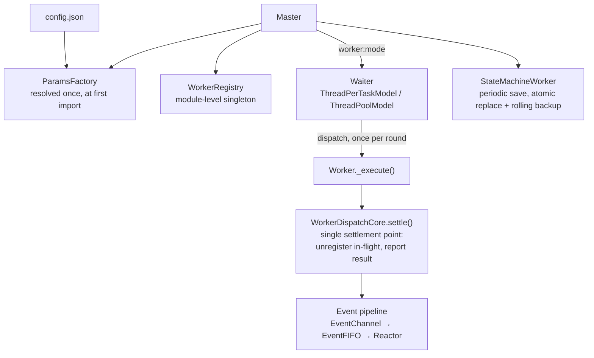
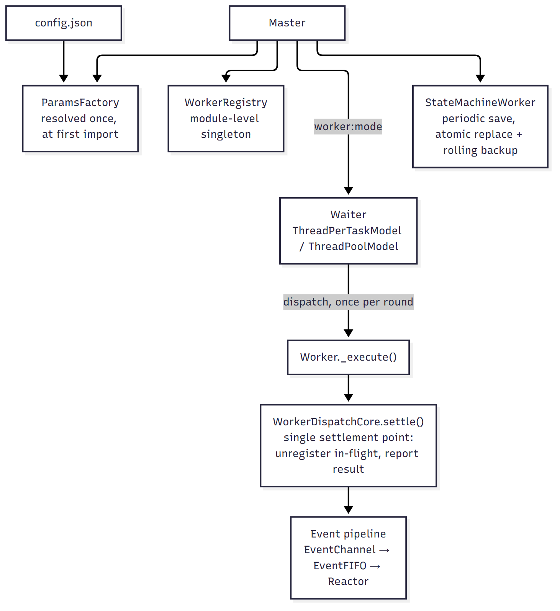
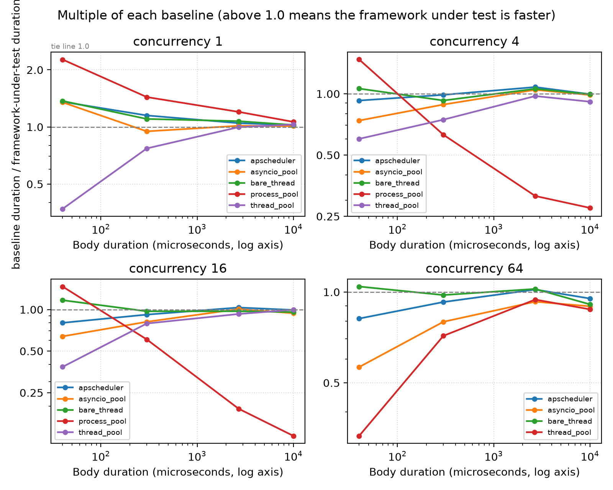

<div align="center">


Python declarative multi-task orchestration framework powering next-gen Agents and workflows

[](https://www.python.org/)
[](https://pypi.org/project/zoo-framework/)
[](LICENSE)
[](https://github.com/YearsAlso/zoo-framework/actions/workflows/tests.yml)
[](https://github.com/YearsAlso/zoo-framework/actions/workflows/quality.yml)
[](https://github.com/YearsAlso/zoo-framework/actions/workflows/codeql.yml)
[](https://scorecard.dev/viewer/?uri=github.com/YearsAlso/zoo-framework)
[](https://yearsalso.github.io/zoo-bench/)

[English](README.md) | [中文](README.zh.md)

</div>

---

### What it is

Zoo Framework runs **long-lived background tasks** in Python. You declare task units
("Workers"), register them, and the framework keeps them running: it decides when each
one is dispatched, keeps concurrent instances apart, observes how long they take, and
shuts down cleanly with state on disk.

It is **not** a web framework and **not** a task queue — there is no HTTP layer, no
broker, and no distributed scheduling. It is the in-process equivalent: a scheduler, an
event pipeline, and a state store that you embed in a service.

### The problem it solves

Wiring background work out of raw `threading` looks like twenty lines and turns into a
few hundred: who owns the thread, what stops the same job from overlapping itself, how
does a stuck job get noticed, what happens to in-flight work on shutdown, where does the
state go. Each of those is a place to be subtly wrong, and the failure mode is usually
silence — a job that stopped running, or two that ran at once.

Zoo Framework takes those decisions out of your code:

- **Overlap** — a Worker that is still in flight is skipped for the round, never
  dispatched twice concurrently.
- **Stuck work** — `run_timeout` observes and circuit-breaks. Note the framework does
  **not** force-kill a running Worker; it stops dispatching it.
- **Shutdown** — `Master.shutdown()` stops dispatch, cancels the schedule, stops the
  event pipeline and monitoring, then unregisters every Worker — which is where the
  state machine's final save happens.
- **State** — periodic and on-shutdown persistence, atomic replace, rolling backups.
- **Errors** — unsupported inputs raise rather than silently degrade.

### How it compares

Zoo Framework is one point in a space that already has good tools. It is the right
choice when the work is **long-lived, in-process, and not worth a broker**:

| | Zoo Framework | Celery | APScheduler | asyncio | raw `threading` |
|---|---|---|---|---|---|
| Deployment shape | embedded in your process | separate workers + broker | embedded | embedded | embedded |
| External dependency | none | Redis/RabbitMQ required | none | none | none |
| Execution model | threads (+ coroutines) | processes | threads | single-thread coroutines | threads |
| Across machines | ❌ | ✅ | ❌ | ❌ | ❌ |
| Multi-process | ❌ not implemented | ✅ | ❌ | ❌ | ❌ |
| Cron expressions | ❌ (fixed `delay_time` polling) | ✅ beat | ✅ | ❌ | ❌ |
| Event pipeline, priority, retries, dead-letter | ✅ | partial (queue) | ❌ | ❌ | ❌ |
| Built-in state persistence | ✅ atomic + rolling backup | via result backend | via job store | ❌ | ❌ |
| Failure mode | raises loudly | mostly explicit | mostly explicit | n/a | usually silent |

Read the table as a scope statement, not a scoreboard: Celery is the right answer the
moment work must cross machines, and APScheduler is the right answer for cron. Zoo
Framework deliberately declines both, and the row it wins on is "no external dependency,
no broker, no cron daemon — but still scheduled, still observable, still persistent."
The comparison reflects each project's general positioning; no cross-project benchmark
was run.

### Installation

```bash
pip install zoo-framework
```

Requires Python 3.13+.

### Quick Start

A minimal runnable Worker. Save as `main.py` and run it:

```python
from zoo_framework.core import Master
from zoo_framework.workers import BaseWorker


class MyWorker(BaseWorker):
    """A task unit that runs in a loop."""

    def __init__(self):
        super().__init__(
            {
                "is_loop": True,  # keep running across scheduling rounds
                "delay_time": 1.0,  # seconds to wait after each execution
                "name": "MyWorker",
                # "run_timeout": 30,  # optional: observe + circuit-break after 30s
            }
        )
        self.counter = 0

    def _execute(self):
        self.counter += 1
        print(f"Hello from MyWorker! Count: {self.counter}")


if __name__ == "__main__":
    master = Master()
    # Registered workers join the schedule. Master() alone only runs the two
    # built-in system workers (EventWorker / StateMachineWorker).
    master.register_worker("MyWorker", MyWorker)
    master.run()
```

There is no separate config file to write — `Master()` defaults to `./config.json`
relative to the working directory, and the example above runs without one. To scaffold a
project with a config and directory layout, use the CLI instead:

```bash
zfc --create myapp      # -> myapp/src/{main.py,workers,conf,params,events}
cd myapp
zfc --worker my_task    # adds src/workers/my_task_worker.py and registers it
python src/main.py
```

> **A Worker must be registered as a *class*.** `WorkerRegistry` validates with
> `issubclass`, so a function or an instance is rejected with
> `TypeError: issubclass() arg 1 must be a class`. This holds **independently of `@cage`**:
> *any* wrapper that replaces the class with a factory function fails the same way, and the
> rule still stands now that `@cage` is **removed**. Process-level sharing is declared
> through the container instead.

<!--
演示图占位（demo image placeholder）—— 产出图片后，删掉下面这行图片引用前的注释标记即可。

  1. 录制：Windows 用 ScreenToGif；macOS / Linux 用 asciinema + agg
  2. 内容：`zfc --create myapp && cd myapp && python src/main.py`，录 10–15 秒，
     展示 Worker 每轮被派发与日志持续输出
  3. 存放：`docs/assets/demo.gif`
  4. 若动图不便，也可只截一张架构图 —— 下一节的 Mermaid 图可直接在 GitHub 上截图复用
-->
<!--  -->

### How it runs

```
Master.run()
   └─ scheduling round (every 1s)
        ├─ for each registered Worker:
        │    ├─ timed out?        → circuit-break, stop dispatching it
        │    ├─ still in flight?  → skip this round
        │    └─ otherwise         → dispatch to a thread / the pool
        └─ on completion: unregister in-flight, report result to the event pipeline
```

Workers execute **concurrently** within a round and are never dispatched twice at the
same time. `Master.shutdown()` stops dispatch first, then cancels the scheduling task,
stops the event loop, stops monitoring, and finally unregisters every Worker — which is
where the state machine's last save happens.

How the pieces connect:


```mermaid
flowchart TB
    cfg["config.json"] --> pf["ParamsFactory<br/>resolved once, at first import"]
    m["Master"] --> pf
    m --> wr["WorkerRegistry<br/>module-level singleton"]
    m -->|"worker:mode"| w["Waiter<br/>ThreadPerTaskModel / ThreadPoolModel"]
    w -->|"dispatch, once per round"| wk["Worker._execute()"]
    wk --> set["WorkerDispatchCore.settle()<br/>single settlement point:<br/>unregister in-flight, report result"]
    set --> pipe["Event pipeline<br/>EventChannel → EventFIFO → Reactor"]
    m --> sm["StateMachineWorker<br/>periodic save, atomic replace + rolling backup"]
```



### Features

| Capability | Status |
|---|---|
| **Multi-threaded scheduling** | ✅ Two modes: `thread` (one thread per dispatch) and `thread_pool` (bounded pool) |
| Loop / single-shot workers | ✅ Declared via `is_loop` |
| In-flight tracking & timeouts | ✅ Observe + circuit-break. The framework does **not** force-kill a running worker |
| **Coroutine workers** | ✅ `AsyncWorker` subclasses execute on the scheduler path. Each execution gets its own event loop (`asyncio.run`), so separate workers do not share an event loop |
| **Multi-process execution** | ❌ **Not implemented.** The mode constants are placeholders and a request for them is explicitly rejected |
| Event pipeline | ✅ Channel isolation, priority ordering, retry strategies, dead-letter records |
| State persistence | ✅ Periodic + on-shutdown save, atomic replace, rolling backups |
| Worker registration | ✅ By class, instance, or factory; lazy instantiation; metadata, tags, priority |
| Health monitoring (SVM) | ⚠️ Metric pipeline not yet wired — `get_health_report()` always reports `execute_count: 0` |

#### Core concepts

The framework is named after a zoo, but **the metaphor only affects naming, not
semantics** — if a name is unclear, read the right-hand column:

| Metaphor | Component | Role |
|---|---|---|
| 🦁 **Worker** | `BaseWorker` subclass | Task execution unit; implement `_execute()` |
| 👨🌾 **Master** | `Master` | Lifecycle entry point: load config, register Workers, start scheduling, shut down |
| 🍽️ **Waiter** | `core/waiter/` | The scheduler. `worker:mode` picks the model (`thread` / `thread_pool`); `worker:runPolicy` only sets the pool's backpressure (`simple` expand / `stable` queue / `safe` reject) |
| 🏠 **Cage** | `ScopedContainer` | **Scoped registry**: holds shared instances per scope (process / session / prototype). Instances are declared, then resolved; `reset()` / `replace()` are the test seams |
| 🍎 **Event** | `EventNode` / `EventChannel` | Inter-worker message, carrying channel, priority and retry count |
| 🥘 **FIFO** | `EventFIFO` | One independent queue per channel |
| 📢 **Reactor** | `EventReactor` | Event responder, registered via `@event(topic, channel=...)` |
| 🔄 **StateMachine** | `StateMachineManager` | Read/write state by "scope + key path", with observers and persistence |

#### Event pipeline

```python
from zoo_framework.core.aop import event


@event(topic="order.created", channel="business")
def on_order_created(req):
    print(req.topic, req.content)
```

Events are isolated per channel; an event can select its response mechanism (first
responder only / by priority / all / a named responder). Reactor registration is
idempotent — registering the same object twice does not append it twice.

#### State machine

Read and write by "scope + key path"; key paths support dotted nesting:

```python
from zoo_framework.statemachine import StateMachineManager

sm = StateMachineManager()

sm.set_state("order", "status", "pending")  # first write creates the scope
sm.set_state("order", "status", "paid")  # overwrite
sm.get_state("order", "status")  # -> 'paid'

sm.set_state("order", "item.count", 2)  # nested key
sm.get_state("order", "item.count")  # -> 2

# Observe changes
sm.observe_state("order", "status", lambda payload: print(payload["value"]))
sm.unobserve_state("order", "status", observer)
```

State is persisted periodically by `StateMachineWorker` and once more on shutdown:
written to a `.tmp` file then atomically replaced, keeping the last 5 backups in a
sibling `backups/` directory.

#### CLI

```bash
# Scaffold a project (produces <name>/src/{main.py,workers,conf,params,events})
zfc --create myapp

# Add a Worker to a project (writes src/workers/, and wires it into src/main.py)
cd myapp
zfc --worker my_task

# Run
python src/main.py
```

There are exactly two options, `--create` and `--worker`, and they may be combined in one
call (`zfc --create myapp --worker my_task` puts the Worker into the project being
created). Both validate their input **before** producing anything, and neither accepts a
silently ineffective call:

- `--create` **fails and exits** if the target directory already exists — it does not
  merge and does not overwrite. Check for the directory yourself if you need idempotency
  in a script.
- `--worker` names must be valid Python identifiers: no leading digit, no hyphens, dots
  or spaces, no keywords. `my-task` and `123task` are rejected; use underscores
  (`my_task`).

On failure the command exits non-zero with a reason, leaving no half-written output.

### Performance

Measured on Windows, Python 3.13, with a representative workload (JSON encode/decode +
string processing). `bench/` has the scripts and raw data.

| Worker body | End-to-end | Framework overhead | Share |
|---|---|---|---|
| ~0.04 ms | 0.133 ms | 0.094 ms | 71% |
| ~0.29 ms | 0.391 ms | 0.102 ms | 26% |
| ~2.7 ms | 2.858 ms | 0.124 ms | 4.3% |
| ~10.3 ms | 10.551 ms | 0.219 ms | 2.1% |

Framework overhead is roughly **100–220 µs per task** and is dominated by thread
dispatch and the wake-up back to the scheduler. It is therefore negligible for
millisecond-scale work and dominant for sub-100 µs work — pick your task granularity
accordingly. `bench/DECISION.md` has the breakdown and the cross-platform caveats.


*End-to-end duration of each baseline relative to Zoo Framework (above 1.0 = Zoo
faster): at concurrency 1 and the smallest body tier Zoo is **2.27× faster than
`process_pool`**, and at parity with `apscheduler` / `asyncio` / bare threads once
the body is ≳40 µs. Snapshot of the 0.10.0 run — the maintained, version-by-version
report lives at [zoo-bench](https://yearsalso.github.io/zoo-bench/).*

> **On the numbers above.** They are one-off evidence from the `adopt-rust-core` study,
> measured on Windows only — do not compare them against Linux runs.
> The **maintained, version-by-version benchmark** lives in the separate
> [`zoo-bench`](https://github.com/YearsAlso/zoo-bench) repo:
> [live report](https://yearsalso.github.io/zoo-bench/). It runs on native Linux CI, compares
> against hand-written baselines and the standard-library concurrency models, publishes its
> raw data, and reports the tiers where the framework **loses**.

### Built for AI-agent-generated code

The extension surface is deliberately narrow, so generated code is short, verifiable,
and — when it is wrong — wrong *loudly*.

**Three steps, no glue code**

```python
class OrderSyncWorker(BaseWorker):  # 1. subclass
    def __init__(self):
        super().__init__({"is_loop": True, "delay_time": 5, "name": "OrderSync"})

    def _execute(self):  # 2. write only the business logic
        sync_orders()


master.register_worker("OrderSync", OrderSyncWorker)  # 3. register
```

Thread management, concurrency limits, in-flight de-duplication, timeout
circuit-breaking, graceful shutdown and state persistence are the framework's job.
An agent does not have to generate that code — and therefore cannot get it wrong.

**Configuration is separate from implementation**

A Worker only depends on the `props` dict handed to `__init__`. It has no visibility
into framework internals, so generating one does not require reading the source or
understanding how `Waiter` / `WorkerRegistry` / `EventReactor` relate.

**Failures are explicit, never silently swallowed**

| Input | Behaviour |
|---|---|
| A scheduler mode that isn't implemented (`process`) | raises `NotImplementedError` |
| An unrecognised run-policy name in config | raises `ValueError` |
| Importing a public name that doesn't exist | `ImportError` |
| A text file in an unexpected encoding | emits a warning naming the file |

This matters more for generated code than for hand-written code: an agent **cannot
detect a silent downgrade**, and a loud error is the signal it needs to self-correct.

**Changes can be checked automatically**

The framework carries a spec baseline and a 367-case regression suite covering the
core contracts, so an agent's change can be judged by running `pytest` rather than by
asking a human to read it.

### Documentation

- [Architecture](docs/ARCHITECTURE.md) — module layout and data flow
- [API Reference](docs/API_REFERENCE.md)
- [Development Guide](docs/DEVELOPMENT.md)
- [Debugging Guide](docs/DEBUGGING.md)
- [Roadmap](docs/ROADMAP.md)

### Community & Feedback

- **Questions, ideas, bug reports** — [GitHub Issues](https://github.com/YearsAlso/zoo-framework/issues)
  is the single channel; there is no chat server or mailing list.
- **Security vulnerabilities** — do **not** open a public issue. See
  [SECURITY.md](SECURITY.md) for the private reporting route.
- **Code of Conduct** — [CODE_OF_CONDUCT.md](CODE_OF_CONDUCT.md).

The project is maintained by one person, so issues are answered on a best-effort basis.
A report with a reproduction, your Python version and your OS gets a response far
faster than one without.

### Contributing

Contributions are welcome — see [CONTRIBUTING.md](CONTRIBUTING.md) for the full guide.

```bash
git clone https://github.com/YearsAlso/zoo-framework.git
cd zoo-framework
pip install -e ".[dev]"       # NOT `uv sync` — uv.lock is stale, see CONTRIBUTING.md
pre-commit install
pytest                        # 662 cases
```

Note: use an explicit Python 3.13 interpreter (`.venv/Scripts/python.exe` on Windows —
if you prefer uv, `uv run --no-sync`; plain `uv run` re-locks from the stale `uv.lock`).
`ruff check`, `ruff format`, `pytest`, `mypy` and `bandit` are all hard CI
gates.

### License

Apache License 2.0 © [XiangMeng](https://github.com/YearsAlso)

---
