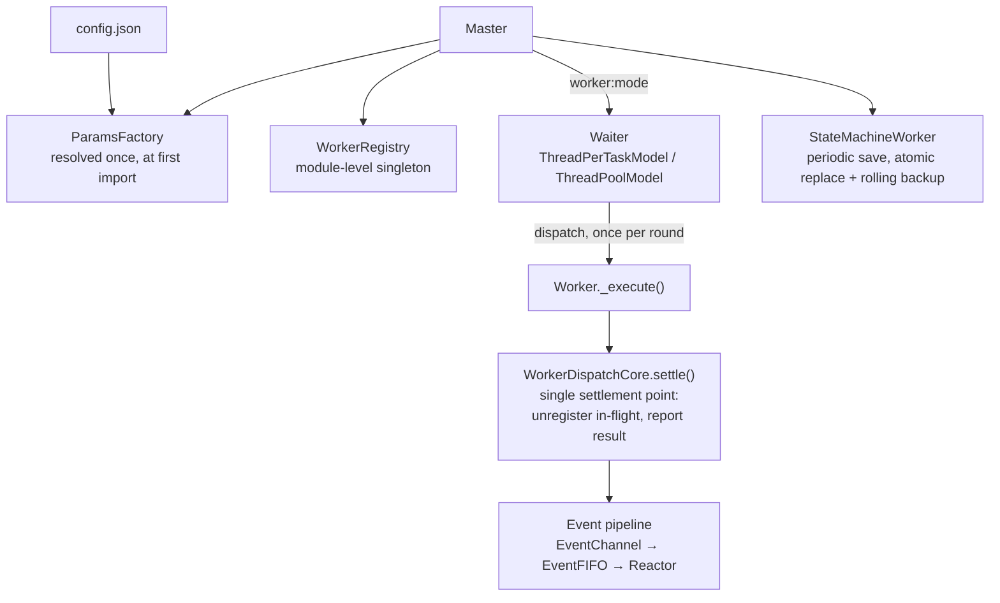
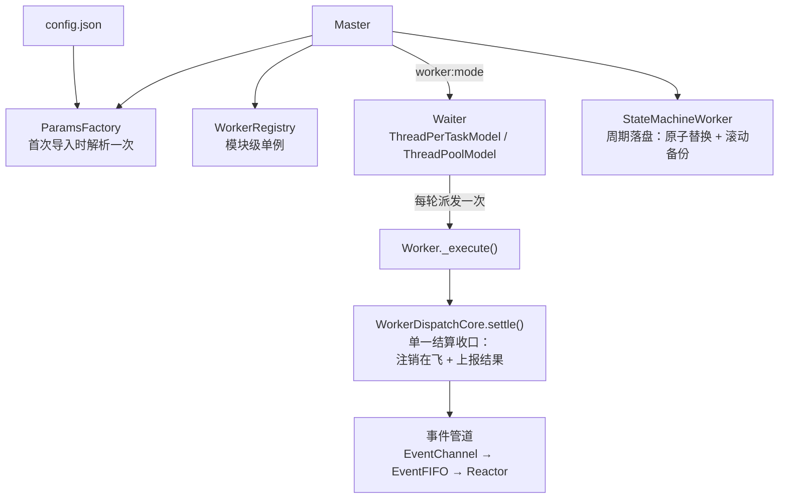

<div align="center">


Python 声明式多任务编排框架，一站式支撑下一代 Agent 与工作流
Python declarative multi-task orchestration framework powering next-gen Agents and workflows

[](https://www.python.org/)
[](https://pypi.org/project/zoo-framework/)
[](LICENSE)
[](https://github.com/YearsAlso/zoo-framework/actions/workflows/tests.yml)
[](https://github.com/YearsAlso/zoo-framework/actions/workflows/quality.yml)

[English](#english) | [中文](#中文)

</div>

---

<a name="english"></a>
## 🇬🇧 English

### What it is

Zoo Framework runs **long-lived background tasks** in Python. You declare task units
("Workers"), register them, and the framework keeps them running: it decides when each
one is dispatched, keeps concurrent instances apart, observes how long they take, and
shuts down cleanly with state on disk.

It is **not** a web framework and **not** a task queue — there is no HTTP layer, no
broker, and no distributed scheduling. It is the in-process equivalent: a scheduler, an
event pipeline, and a state store that you embed in a service.

### The problem it solves

Wiring background work out of raw `threading` looks like twenty lines and turns into a
few hundred: who owns the thread, what stops the same job from overlapping itself, how
does a stuck job get noticed, what happens to in-flight work on shutdown, where does the
state go. Each of those is a place to be subtly wrong, and the failure mode is usually
silence — a job that stopped running, or two that ran at once.

Zoo Framework takes those decisions out of your code:

- **Overlap** — a Worker that is still in flight is skipped for the round, never
  dispatched twice concurrently.
- **Stuck work** — `run_timeout` observes and circuit-breaks. Note the framework does
  **not** force-kill a running Worker; it stops dispatching it.
- **Shutdown** — `Master.shutdown()` stops dispatch, cancels the schedule, stops the
  event pipeline and monitoring, then unregisters every Worker — which is where the
  state machine's final save happens.
- **State** — periodic and on-shutdown persistence, atomic replace, rolling backups.
- **Errors** — unsupported inputs raise rather than silently degrade.

### How it compares

Zoo Framework is one point in a space that already has good tools. It is the right
choice when the work is **long-lived, in-process, and not worth a broker**:

| | Zoo Framework | Celery | APScheduler | asyncio | raw `threading` |
|---|---|---|---|---|---|
| Deployment shape | embedded in your process | separate workers + broker | embedded | embedded | embedded |
| External dependency | none | Redis/RabbitMQ required | none | none | none |
| Execution model | threads (+ coroutines) | processes | threads | single-thread coroutines | threads |
| Across machines | ❌ | ✅ | ❌ | ❌ | ❌ |
| Multi-process | ❌ not implemented | ✅ | ❌ | ❌ | ❌ |
| Cron expressions | ❌ (fixed `delay_time` polling) | ✅ beat | ✅ | ❌ | ❌ |
| Event pipeline, priority, retries, dead-letter | ✅ | partial (queue) | ❌ | ❌ | ❌ |
| Built-in state persistence | ✅ atomic + rolling backup | via result backend | via job store | ❌ | ❌ |
| Failure mode | raises loudly | mostly explicit | mostly explicit | n/a | usually silent |

Read the table as a scope statement, not a scoreboard: Celery is the right answer the
moment work must cross machines, and APScheduler is the right answer for cron. Zoo
Framework deliberately declines both, and the row it wins on is "no external dependency,
no broker, no cron daemon — but still scheduled, still observable, still persistent."
The comparison reflects each project's general positioning; no cross-project benchmark
was run.

### Installation

```bash
pip install zoo-framework
```

Requires Python 3.13+.

### Quick Start

A minimal runnable Worker. Save as `main.py` and run it:

```python
from zoo_framework.core import Master
from zoo_framework.workers import BaseWorker


class MyWorker(BaseWorker):
    """A task unit that runs in a loop."""

    def __init__(self):
        super().__init__(
            {
                "is_loop": True,  # keep running across scheduling rounds
                "delay_time": 1.0,  # seconds to wait after each execution
                "name": "MyWorker",
                # "run_timeout": 30,  # optional: observe + circuit-break after 30s
            }
        )
        self.counter = 0

    def _execute(self):
        self.counter += 1
        print(f"Hello from MyWorker! Count: {self.counter}")


if __name__ == "__main__":
    master = Master()
    # Registered workers join the schedule. Master() alone only runs the two
    # built-in system workers (EventWorker / StateMachineWorker).
    master.register_worker("MyWorker", MyWorker)
    master.run()
```

There is no separate config file to write — `Master()` defaults to `./config.json`
relative to the working directory, and the example above runs without one. To scaffold a
project with a config and directory layout, use the CLI instead:

```bash
zfc --create myapp      # -> myapp/src/{main.py,workers,conf,params,events}
cd myapp
zfc --worker my_task    # adds src/workers/my_task_worker.py and registers it
python src/main.py
```

> **A Worker must be registered as a *class*.** `WorkerRegistry` validates with
> `issubclass`, so a function or an instance is rejected with
> `TypeError: issubclass() arg 1 must be a class`. This holds **independently of `@cage`**:
> *any* wrapper that replaces the class with a factory function fails the same way, and the
> rule still stands now that `@cage` is **removed**. Process-level sharing is declared
> through the container instead.

<!--
演示图占位（demo image placeholder）—— 产出图片后，删掉下面这行图片引用前的注释标记即可。

  1. 录制：Windows 用 ScreenToGif；macOS / Linux 用 asciinema + agg
  2. 内容：`zfc --create myapp && cd myapp && python src/main.py`，录 10–15 秒，
     展示 Worker 每轮被派发与日志持续输出
  3. 存放：`docs/assets/demo.gif`
  4. 若动图不便，也可只截一张架构图 —— 下一节的 Mermaid 图可直接在 GitHub 上截图复用
-->
<!--  -->

### How it runs

```
Master.run()
   └─ scheduling round (every 1s)
        ├─ for each registered Worker:
        │    ├─ timed out?        → circuit-break, stop dispatching it
        │    ├─ still in flight?  → skip this round
        │    └─ otherwise         → dispatch to a thread / the pool
        └─ on completion: unregister in-flight, report result to the event pipeline
```

Workers execute **concurrently** within a round and are never dispatched twice at the
same time. `Master.shutdown()` stops dispatch first, then cancels the scheduling task,
stops the event loop, stops monitoring, and finally unregisters every Worker — which is
where the state machine's last save happens.

How the pieces connect:


```mermaid
flowchart TB
    cfg["config.json"] --> pf["ParamsFactory<br/>resolved once, at first import"]
    m["Master"] --> pf
    m --> wr["WorkerRegistry<br/>module-level singleton"]
    m -->|"worker:mode"| w["Waiter<br/>ThreadPerTaskModel / ThreadPoolModel"]
    w -->|"dispatch, once per round"| wk["Worker._execute()"]
    wk --> set["WorkerDispatchCore.settle()<br/>single settlement point:<br/>unregister in-flight, report result"]
    set --> pipe["Event pipeline<br/>EventChannel → EventFIFO → Reactor"]
    m --> sm["StateMachineWorker<br/>periodic save, atomic replace + rolling backup"]
```

### Features

| Capability | Status |
|---|---|
| **Multi-threaded scheduling** | ✅ Two modes: `thread` (one thread per dispatch) and `thread_pool` (bounded pool) |
| Loop / single-shot workers | ✅ Declared via `is_loop` |
| In-flight tracking & timeouts | ✅ Observe + circuit-break. The framework does **not** force-kill a running worker |
| **Coroutine workers** | ✅ `AsyncWorker` subclasses execute on the scheduler path. Each execution gets its own event loop (`asyncio.run`), so separate workers do not share an event loop |
| **Multi-process execution** | ❌ **Not implemented.** The mode constants are placeholders and a request for them is explicitly rejected |
| Event pipeline | ✅ Channel isolation, priority ordering, retry strategies, dead-letter records |
| State persistence | ✅ Periodic + on-shutdown save, atomic replace, rolling backups |
| Worker registration | ✅ By class, instance, or factory; lazy instantiation; metadata, tags, priority |
| Health monitoring (SVM) | ⚠️ Metric pipeline not yet wired — `get_health_report()` always reports `execute_count: 0` |

#### Core concepts

The framework is named after a zoo, but **the metaphor only affects naming, not
semantics** — if a name is unclear, read the right-hand column:

| Metaphor | Component | Role |
|---|---|---|
| 🦁 **Worker** | `BaseWorker` subclass | Task execution unit; implement `_execute()` |
| 👨🌾 **Master** | `Master` | Lifecycle entry point: load config, register Workers, start scheduling, shut down |
| 🍽️ **Waiter** | `core/waiter/` | The scheduler. `worker:mode` picks the model (`thread` / `thread_pool`); `worker:runPolicy` only sets the pool's backpressure (`simple` expand / `stable` queue / `safe` reject) |
| 🏠 **Cage** | `ScopedContainer` | **Scoped registry**: holds shared instances per scope (process / session / prototype). Instances are declared, then resolved; `reset()` / `replace()` are the test seams |
| 🍎 **Event** | `EventNode` / `EventChannel` | Inter-worker message, carrying channel, priority and retry count |
| 🥘 **FIFO** | `EventFIFO` | One independent queue per channel |
| 📢 **Reactor** | `EventReactor` | Event responder, registered via `@event(topic, channel=...)` |
| 🔄 **StateMachine** | `StateMachineManager` | Read/write state by "scope + key path", with observers and persistence |

#### Event pipeline

```python
from zoo_framework.core.aop import event


@event(topic="order.created", channel="business")
def on_order_created(req):
    print(req.topic, req.content)
```

Events are isolated per channel; an event can select its response mechanism (first
responder only / by priority / all / a named responder). Reactor registration is
idempotent — registering the same object twice does not append it twice.

#### State machine

Read and write by "scope + key path"; key paths support dotted nesting:

```python
from zoo_framework.statemachine import StateMachineManager

sm = StateMachineManager()

sm.set_state("order", "status", "pending")  # first write creates the scope
sm.set_state("order", "status", "paid")  # overwrite
sm.get_state("order", "status")  # -> 'paid'

sm.set_state("order", "item.count", 2)  # nested key
sm.get_state("order", "item.count")  # -> 2

# Observe changes
sm.observe_state("order", "status", lambda payload: print(payload["value"]))
sm.unobserve_state("order", "status", observer)
```

State is persisted periodically by `StateMachineWorker` and once more on shutdown:
written to a `.tmp` file then atomically replaced, keeping the last 5 backups in a
sibling `backups/` directory.

#### CLI

```bash
# Scaffold a project (produces <name>/src/{main.py,workers,conf,params,events})
zfc --create myapp

# Add a Worker to a project (writes src/workers/, and wires it into src/main.py)
cd myapp
zfc --worker my_task

# Run
python src/main.py
```

There are exactly two options, `--create` and `--worker`, and they may be combined in one
call (`zfc --create myapp --worker my_task` puts the Worker into the project being
created). Both validate their input **before** producing anything, and neither accepts a
silently ineffective call:

- `--create` **fails and exits** if the target directory already exists — it does not
  merge and does not overwrite. Check for the directory yourself if you need idempotency
  in a script.
- `--worker` names must be valid Python identifiers: no leading digit, no hyphens, dots
  or spaces, no keywords. `my-task` and `123task` are rejected; use underscores
  (`my_task`).

On failure the command exits non-zero with a reason, leaving no half-written output.

### Performance

Measured on Windows, Python 3.13, with a representative workload (JSON encode/decode +
string processing). `bench/` has the scripts and raw data.

| Worker body | End-to-end | Framework overhead | Share |
|---|---|---|---|
| ~0.04 ms | 0.133 ms | 0.094 ms | 71% |
| ~0.29 ms | 0.391 ms | 0.102 ms | 26% |
| ~2.7 ms | 2.858 ms | 0.124 ms | 4.3% |
| ~10.3 ms | 10.551 ms | 0.219 ms | 2.1% |

Framework overhead is roughly **100–220 µs per task** and is dominated by thread
dispatch and the wake-up back to the scheduler. It is therefore negligible for
millisecond-scale work and dominant for sub-100 µs work — pick your task granularity
accordingly. `bench/DECISION.md` has the breakdown and the cross-platform caveats.

> **On the numbers above.** They are one-off evidence from the `adopt-rust-core` study,
> measured on Windows only — do not compare them against Linux runs.
> The **maintained, version-by-version benchmark** lives in the separate
> [`zoo-bench`](https://github.com/YearsAlso/zoo-bench) repo:
> [live report](https://yearsalso.github.io/zoo-bench/). It runs on native Linux CI, compares
> against hand-written baselines and the standard-library concurrency models, publishes its
> raw data, and reports the tiers where the framework **loses**.

### Built for AI-agent-generated code

The extension surface is deliberately narrow, so generated code is short, verifiable,
and — when it is wrong — wrong *loudly*.

**Three steps, no glue code**

```python
class OrderSyncWorker(BaseWorker):  # 1. subclass
    def __init__(self):
        super().__init__({"is_loop": True, "delay_time": 5, "name": "OrderSync"})

    def _execute(self):  # 2. write only the business logic
        sync_orders()


master.register_worker("OrderSync", OrderSyncWorker)  # 3. register
```

Thread management, concurrency limits, in-flight de-duplication, timeout
circuit-breaking, graceful shutdown and state persistence are the framework's job.
An agent does not have to generate that code — and therefore cannot get it wrong.

**Configuration is separate from implementation**

A Worker only depends on the `props` dict handed to `__init__`. It has no visibility
into framework internals, so generating one does not require reading the source or
understanding how `Waiter` / `WorkerRegistry` / `EventReactor` relate.

**Failures are explicit, never silently swallowed**

| Input | Behaviour |
|---|---|
| A scheduler mode that isn't implemented (`process`) | raises `NotImplementedError` |
| An unrecognised run-policy name in config | raises `ValueError` |
| Importing a public name that doesn't exist | `ImportError` |
| A text file in an unexpected encoding | emits a warning naming the file |

This matters more for generated code than for hand-written code: an agent **cannot
detect a silent downgrade**, and a loud error is the signal it needs to self-correct.

**Changes can be checked automatically**

The framework carries a spec baseline and a 367-case regression suite covering the
core contracts, so an agent's change can be judged by running `pytest` rather than by
asking a human to read it.

### Documentation

- [Architecture](docs/ARCHITECTURE.md) — module layout and data flow
- [API Reference](docs/API_REFERENCE.md)
- [Development Guide](docs/DEVELOPMENT.md)
- [Debugging Guide](docs/DEBUGGING.md)
- [Roadmap](docs/ROADMAP.md)

### Community & Feedback

- **Questions, ideas, bug reports** — [GitHub Issues](https://github.com/YearsAlso/zoo-framework/issues)
  is the single channel; there is no chat server or mailing list.
- **Security vulnerabilities** — do **not** open a public issue. See
  [SECURITY.md](SECURITY.md) for the private reporting route.
- **Code of Conduct** — [CODE_OF_CONDUCT.md](CODE_OF_CONDUCT.md).

The project is maintained by one person, so issues are answered on a best-effort basis.
A report with a reproduction, your Python version and your OS gets a response far
faster than one without.

### Contributing

Contributions are welcome — see [CONTRIBUTING.md](CONTRIBUTING.md) for the full guide.

```bash
git clone https://github.com/YearsAlso/zoo-framework.git
cd zoo-framework
pip install -e ".[dev]"       # NOT `uv sync` — uv.lock is stale, see CONTRIBUTING.md
pre-commit install
pytest                        # 662 cases
```

Note: use an explicit Python 3.13 interpreter (`.venv/Scripts/python.exe` on Windows —
if you prefer uv, `uv run --no-sync`; plain `uv run` re-locks from the stale `uv.lock`).
`ruff check`, `ruff format`, `pytest`, `mypy` and `bandit` are all hard CI
gates.

### License

Apache License 2.0 © [XiangMeng](https://github.com/YearsAlso)

---

<a name="中文"></a>
## 🇨🇳 中文

### 这是什么

Zoo Framework 用来运行**长期存活的后台任务**。你声明任务单元（Worker）并注册它们，
框架负责让它们持续跑下去：决定每一个何时被派发、避免并发实例互相干扰、观测它们跑了
多久、并在停机时把状态干净地落盘。

它**不是** Web 框架，也**不是**任务队列 —— 没有 HTTP 层、没有 broker、没有分布式调度。
它是进程内的等价物：一个可以嵌进服务里的调度器 + 事件管道 + 状态存储。

### 解决什么问题

用裸 `threading` 搭后台任务，写起来像是二十行的事，最后会长成几百行：线程归谁管、
怎么保证同一个任务不自我重叠、卡住的任务谁来发现、停机时正在跑的任务怎么办、状态放
哪里。每一条都是可能悄悄写错的地方，而且出错方式通常就是**静默** —— 某个任务不再跑
了，或者两个实例同时跑了。

Zoo Framework 把这些决定从你的代码里拿走：

- **重叠** —— 仍在执行中的 Worker 本轮跳过，永远不会被并发派发两次。
- **卡住的任务** —— `run_timeout` 负责观测并熔断。注意框架**不会**强制终止正在执行的
  Worker，它只是停止继续派发。
- **停机** —— `Master.shutdown()` 先停派发，再取消调度、停事件管道与监控，最后注销
  全部 Worker —— 状态机的最后一次落盘就发生在这条链路的末尾。
- **状态** —— 周期落盘 + 停机落盘，原子替换，滚动备份。
- **错误** —— 不受支持的输入抛异常，而不是静默降级。

### 同类方案对比

Zoo Framework 处在一个已经有优秀工具的空间里。它合适的场景是：任务**长期存活、在进程
内、且不值得为它引入 broker**。

| | Zoo Framework | Celery | APScheduler | asyncio | 裸 `threading` |
|---|---|---|---|---|---|
| 部署形态 | 嵌入你的进程 | 独立 worker + broker | 嵌入 | 嵌入 | 嵌入 |
| 外部依赖 | 无 | 必须 Redis/RabbitMQ | 无 | 无 | 无 |
| 执行模型 | 线程（+ 协程） | 进程 | 线程 | 单线程协程 | 线程 |
| 跨机器 | ❌ | ✅ | ❌ | ❌ | ❌ |
| 多进程 | ❌ 未实现 | ✅ | ❌ | ❌ | ❌ |
| Cron 表达式 | ❌（固定 `delay_time` 轮询） | ✅ beat | ✅ | ❌ | ❌ |
| 事件管道、优先级、重试、死信 | ✅ | 部分（队列） | ❌ | ❌ | ❌ |
| 内建状态持久化 | ✅ 原子落盘 + 滚动备份 | 依赖结果后端 | 依赖 job store | ❌ | ❌ |
| 出错方式 | 显式抛错 | 多数显式 | 多数显式 | 不适用 | 通常静默 |

这张表是**范围声明，不是打分表**：任务一旦要跨机器，Celery 就是正确答案；需要 cron，
APScheduler 就是正确答案。Zoo Framework 主动放弃了这两项，它赢的那一行是「无外部依赖、
无 broker、无 cron 守护进程 —— 但依然有调度、有观测、有持久化」。表中对比基于各项目公开
的通用定位，**未做过跨项目压测**。

### 安装

```bash
pip install zoo-framework
```

需要 Python 3.13+。

### 快速开始

一个最小可运行的 Worker。存成 `main.py` 直接运行：

```python
from zoo_framework.core import Master
from zoo_framework.workers import BaseWorker


class MyWorker(BaseWorker):
    """一个循环执行的任务单元。"""

    def __init__(self):
        super().__init__(
            {
                "is_loop": True,  # 跨调度轮次持续执行
                "delay_time": 1.0,  # 单次执行结束后的等待秒数
                "name": "MyWorker",
                # "run_timeout": 30,  # 可选：超过 30 秒则熔断
            }
        )
        self.counter = 0

    def _execute(self):
        self.counter += 1
        print(f"Hello from MyWorker! 计数: {self.counter}")


if __name__ == "__main__":
    master = Master()
    # 注册后的 Worker 才会进入调度。只 Master() 的话只会跑内置的两个
    # 系统 Worker（EventWorker / StateMachineWorker）。
    master.register_worker("MyWorker", MyWorker)
    master.run()
```

不需要单独写配置文件 —— `Master()` 默认读工作目录下的 `./config.json`，上面这个例子没有
配置文件也能跑。想要带配置和目录结构的脚手架，用 CLI：

```bash
zfc --create myapp      # -> myapp/src/{main.py,workers,conf,params,events}
cd myapp
zfc --worker my_task    # 写入 src/workers/my_task_worker.py 并自动注册
python src/main.py
```

> **Worker 必须以「类」的形式注册。** `WorkerRegistry` 用 `issubclass` 校验契约，传函数或
> 实例会被拒绝并抛 `TypeError: issubclass() arg 1 must be a class`。这条约束**与 `@cage`
> 无关**：任何把类换成工厂函数的包装都一样失败，`@cage` **删除后它依然成立**。进程级共享
> 现在改由容器声明。

<!--
演示图占位 —— 产出图片后，删掉下面这行图片引用前的注释标记即可。

  1. 录制：Windows 用 ScreenToGif；macOS / Linux 用 asciinema + agg
  2. 内容：`zfc --create myapp && cd myapp && python src/main.py`，录 10–15 秒，
     展示 Worker 每轮被派发与日志持续输出
  3. 存放：`docs/assets/demo.gif`
  4. 若动图不便，也可只截一张架构图 —— 下一节的 Mermaid 图可直接在 GitHub 上截图复用
-->
<!--  -->

### 运行方式

```
Master.run()
   └─ 调度轮次（每秒一次）
        ├─ 遍历已注册的 Worker：
        │    ├─ 已超时？        → 熔断，不再派发
        │    ├─ 仍在执行？      → 本轮跳过
        │    └─ 否则            → 派发到线程 / 资源池
        └─ 执行结束时：注销在飞状态，把结果投递进事件管道
```

同一轮里多个 Worker **并发**执行；同一个 Worker 永远不会被同时派发两次。
`Master.shutdown()` 先停止派发，再取消调度任务、停事件循环、停监控，最后注销全部
Worker —— 状态机的最后一次落盘就发生在这条链路的末尾。

各部件的连接关系：


```mermaid
flowchart TB
    cfg["config.json"] --> pf["ParamsFactory<br/>首次导入时解析一次"]
    m["Master"] --> pf
    m --> wr["WorkerRegistry<br/>模块级单例"]
    m -->|"worker:mode"| w["Waiter<br/>ThreadPerTaskModel / ThreadPoolModel"]
    w -->|"每轮派发一次"| wk["Worker._execute()"]
    wk --> set["WorkerDispatchCore.settle()<br/>单一结算收口：<br/>注销在飞 + 上报结果"]
    set --> pipe["事件管道<br/>EventChannel → EventFIFO → Reactor"]
    m --> sm["StateMachineWorker<br/>周期落盘：原子替换 + 滚动备份"]
```

### 核心特性

| 能力 | 状态 |
|---|---|
| **多线程调度** | ✅ 两种模式：`thread`（每次派发一个线程）与 `thread_pool`（有界资源池） |
| 循环 / 单次 Worker | ✅ 由 `is_loop` 声明 |
| 在飞管理与超时 | ✅ 观测 + 熔断。框架**不会**强制终止正在执行的 Worker |
| **协程 Worker** | ✅ `AsyncWorker` 子类在调度路径上执行。每次执行使用独立事件循环（`asyncio.run`），因此不同 Worker 之间不共享事件循环 |
| **多进程执行** | ❌ **未实现**。模式常量是占位，请求会被显式拒绝 |
| 事件管道 | ✅ 通道隔离、优先级排序、重试策略、死信记录 |
| 状态持久化 | ✅ 周期落盘 + 停机落盘，临时文件原子替换，滚动备份 |
| Worker 注册 | ✅ 支持类 / 实例 / 工厂，延迟实例化，元数据、标签、优先级 |
| 健康监控（SVM） | ⚠️ 指标链路尚未接通 —— `get_health_report()` 恒返回 `execute_count: 0` |

#### 核心概念

框架用动物园隐喻命名，但**隐喻只影响命名，不影响语义** —— 看不懂名字时看右列即可：

| 隐喻 | 对应组件 | 职责 |
|---|---|---|
| 🦁 **Worker** | `BaseWorker` 子类 | 任务执行单元，实现 `_execute()` |
| 👨🌾 **Master** | `Master` | 生命周期入口：加载配置、注册 Worker、启动调度、停机 |
| 🍽️ **Waiter** | `core/waiter/` | 调度器。由 `worker:mode` 选调度模型（`thread` / `thread_pool`，留空则由 `worker:pool:enable` 推导）；`worker:runPolicy` 只决定资源池背压（`simple` 扩容 / `stable` 排队 / `safe` 拒绝） |
| 🏠 **Cage** | `ScopedContainer` | **按作用域注册**：按作用域（进程 / 会话 / 原型）持有共享实例。先声明、再解析；`reset()` / `replace()` 是测试接缝 |
| 🍎 **Event** | `EventNode` / `EventChannel` | Worker 间通信的事件，带通道、优先级与重试次数 |
| 🥘 **FIFO** | `EventFIFO` | 每个通道一条独立队列 |
| 📢 **Reactor** | `EventReactor` | 事件响应器：`@event(topic, channel=...)` 注册 |
| 🔄 **StateMachine** | `StateMachineManager` | 按「作用域 + 键路径」读写状态，支持观察者与落盘 |

#### 事件管道

```python
from zoo_framework.core.aop import event


@event(topic="order.created", channel="business")
def on_order_created(req):
    print(req.topic, req.content)
```

事件按通道隔离；同一事件可选择响应机制（仅首个 / 按优先级 / 全部 / 指定响应器）。
响应器注册是幂等的 —— 同一对象重复注册不会重复追加。

#### 状态机

按「作用域 + 键路径」读写，键路径支持点号嵌套：

```python
from zoo_framework.statemachine import StateMachineManager

sm = StateMachineManager()

sm.set_state("order", "status", "pending")  # 首次写入自动创建作用域
sm.set_state("order", "status", "paid")  # 重复写入覆盖
sm.get_state("order", "status")  # -> 'paid'

sm.set_state("order", "item.count", 2)  # 嵌套键
sm.get_state("order", "item.count")  # -> 2

# 观察状态变化
sm.observe_state("order", "status", lambda payload: print(payload["value"]))
sm.unobserve_state("order", "status", observer)
```

状态由 `StateMachineWorker` 周期落盘，停机时再保存一次（写入 `.tmp` 后原子替换，
并在相邻的 `backups/` 目录保留最近 5 份备份）。

#### CLI 工具

```bash
# 生成一个脚手架项目（产出 <name>/src/{main.py,workers,conf,params,events}）
zfc --create myapp

# 在项目里新增一个 Worker（写入 src/workers/，并接入 src/main.py 的注册表）
cd myapp
zfc --worker my_task

# 启动
python src/main.py
```

选项只有 `--create` 与 `--worker` 两个，可以在同一次调用里组合使用
（`zfc --create myapp --worker my_task` 会把 Worker 直接落进本次创建的项目）。
两者都会在**产出之前**校验输入，并且都不接受「静默无效」的调用：

- `--create` 的目标目录已存在时**报错退出**，不会合并、不会覆盖既有内容；
  脚本中需要幂等时请自行先判断目录是否存在。
- `--worker` 的名称必须是合法 Python 标识符：不能以数字开头，不能含连字符、
  点号或空格，不能是 Python 关键字。`my-task` / `123task` 这类写法会被拒绝，
  请改用下划线命名（`my_task`）。

失败时命令以非 0 退出码结束并说明原因，且不会留下半成品产物。

### 性能

Windows / Python 3.13 实测，负载为代表性任务（JSON 编解码 + 字符串处理）。
脚本与原始数据在 `bench/`。

| Worker 体耗时 | 端到端 | 框架开销 | 占比 |
|---|---|---|---|
| ~0.04 ms | 0.133 ms | 0.094 ms | 71% |
| ~0.29 ms | 0.391 ms | 0.102 ms | 26% |
| ~2.7 ms | 2.858 ms | 0.124 ms | 4.3% |
| ~10.3 ms | 10.551 ms | 0.219 ms | 2.1% |

框架自身开销约为**每任务 100–220 µs**，主要来自线程派发与调度线程的唤醒。因此它对
毫秒级任务是可忽略的，对 100 µs 以下的任务则占主导 —— 任务粒度请据此选择。
拆解与跨平台说明见 `bench/DECISION.md`。

> **关于上面这张表**：它是 `adopt-rust-core` 那次研究留下的**一次性证据**，只在 Windows 上测过
> —— **不要拿它跟 Linux 的数字对比**。
> **逐版本维护的基准**在独立仓库 [`zoo-bench`](https://github.com/YearsAlso/zoo-bench)：
> [线上报告](https://yearsalso.github.io/zoo-bench/)。它跑在原生 Linux CI 上，与手写基线及
> 标准库并发模型横向对照，公开原始数据，并且**如实列出本框架输掉的档位**。

### 面向 AI Agent 的代码生成

框架的扩展面被刻意收窄，使生成的代码短、可校验，而且 —— 出错时**出错得很大声**。

**三步接入，没有胶水代码**

```python
class OrderSyncWorker(BaseWorker):  # 1. 继承
    def __init__(self):
        super().__init__({"is_loop": True, "delay_time": 5, "name": "OrderSync"})

    def _execute(self):  # 2. 只写业务逻辑
        sync_orders()


master.register_worker("OrderSync", OrderSyncWorker)  # 3. 注册
```

线程管理、并发上限、在飞去重、超时熔断、优雅停机、状态落盘全部由框架承担。
Agent 不需要生成这些代码，也就不会把它们生成错。

**配置与实现分离**

Worker 只依赖传给 `__init__` 的 props 字典，不感知框架内部结构。生成一个 Worker
不需要读框架源码，也不需要理解 `Waiter` / `WorkerRegistry` / `EventReactor` 之间的关系。

**失败是显式的，不会被静默吞掉**

| 输入 | 行为 |
|---|---|
| 请求未实现的调度模式（如 `process`） | 抛 `NotImplementedError` |
| 配置里写了无法识别的运行策略名 | 抛 `ValueError` |
| 导入不存在的公开名称 | `ImportError` |
| 文本文件编码与预期不符 | 输出告警并指明文件 |

这一点对生成式代码比对人工代码更重要：**Agent 无法从「静默降级」中察觉自己写错了**，
而明确的报错正是它自我修正所需的信号。

**改动可被自动校验**

框架带 spec 基线与 367 条回归用例，核心契约都有对应用例守护 —— Agent 生成的改动
可以靠 `pytest` 判断对错，而不必靠人逐行读。

### 文档

- [架构设计](docs/ARCHITECTURE.md) — 模块划分与数据流
- [API 参考](docs/API_REFERENCE.md)
- [开发指南](docs/DEVELOPMENT.md)
- [调试指南](docs/DEBUGGING.md)
- [路线图](docs/ROADMAP.md)

### 社区与反馈

- **提问、想法、Bug 上报** —— 统一走 [GitHub Issues](https://github.com/YearsAlso/zoo-framework/issues)，
  项目没有 IM 群或邮件列表。
- **安全漏洞** —— **不要**开公开 issue，请见 [SECURITY.md](SECURITY.md) 的私密上报途径。
- **行为准则** —— [CODE_OF_CONDUCT.md](CODE_OF_CONDUCT.md)。

项目由一个人维护，issue 按尽力而为的原则响应。附带最小复现、Python 版本和操作系统的
报告，会比其他报告快得多。

### 贡献代码

欢迎贡献，完整流程见 [CONTRIBUTING.md](CONTRIBUTING.md)。

```bash
git clone https://github.com/YearsAlso/zoo-framework.git
cd zoo-framework
pip install -e ".[dev]"       # 请勿使用 `uv sync` —— uv.lock 陈旧，见 CONTRIBUTING.md
pre-commit install
pytest                        # 662 条用例
```

注意使用明确的 Python 3.13 解释器（Windows 上是 `.venv/Scripts/python.exe`；
偏好 uv 的话用 `uv run --no-sync`，裸 `uv run` 会从陈旧的 `uv.lock` 重新解析）。
CI 中 `ruff check`、`ruff format`、`pytest`、`mypy` 与
`bandit` 都是硬性门禁。

### 许可证

Apache License 2.0 © [XiangMeng](https://github.com/YearsAlso)

---

<div align="center">

🎪 **Happy Coding in the Zoo!** 🦁

</div>
