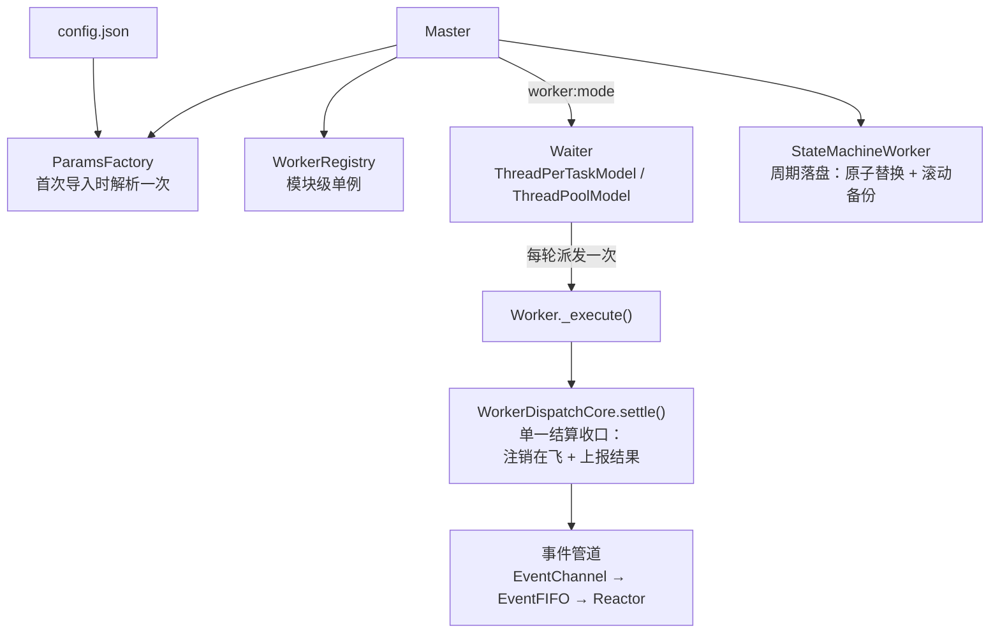
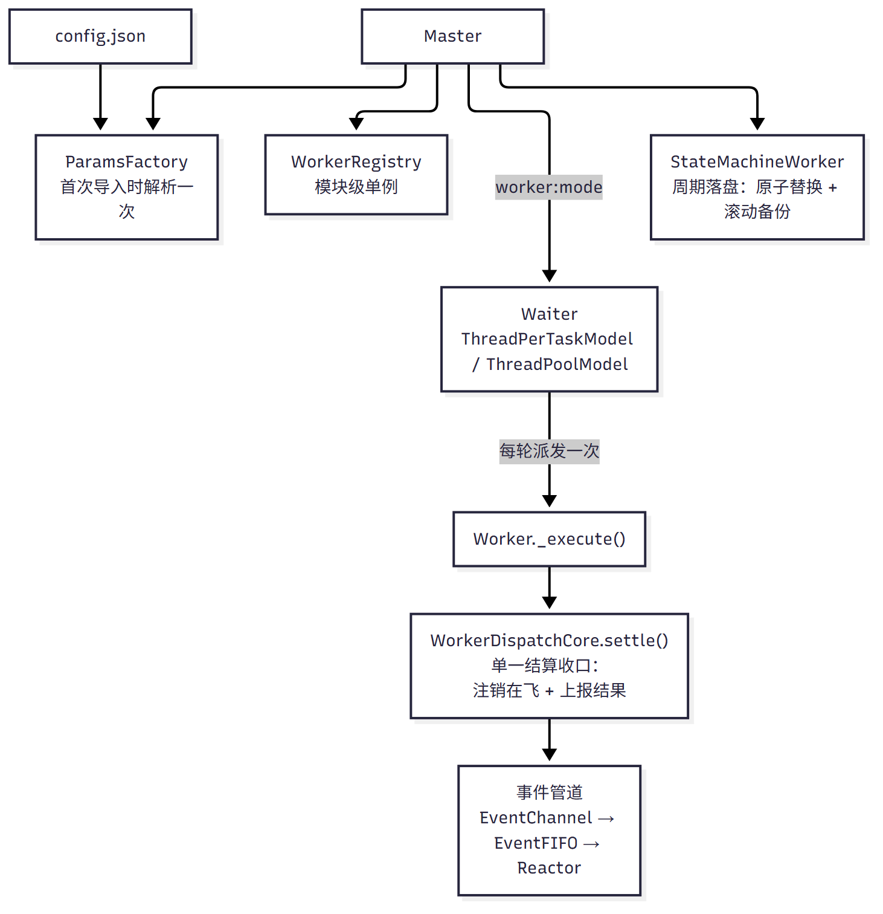
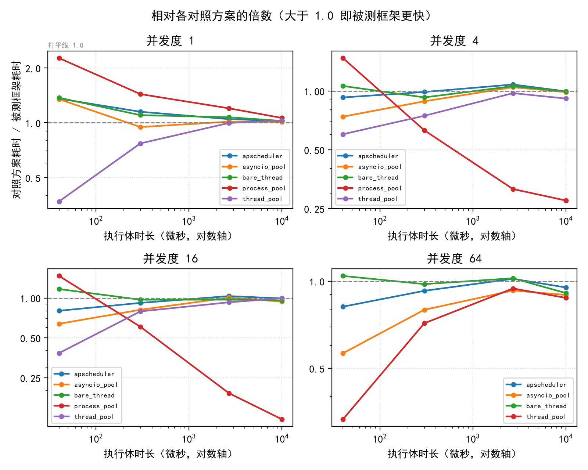

<div align="center">

<picture>
  <source media="(prefers-color-scheme: dark)" srcset="https://raw.githubusercontent.com/YearsAlso/zoo-framework/dev/docs/assets/logo-dark.svg"/>
  <source media="(prefers-color-scheme: light)" srcset="https://raw.githubusercontent.com/YearsAlso/zoo-framework/dev/docs/assets/logo.svg"/>
  
</picture>

Python 声明式多任务编排框架，一站式支撑下一代 Agent 与工作流

[](https://www.python.org/)
[](https://pypi.org/project/zoo-framework/)
[](LICENSE)
[](https://github.com/YearsAlso/zoo-framework/actions/workflows/tests.yml)
[](https://github.com/YearsAlso/zoo-framework/actions/workflows/quality.yml)
[](https://github.com/YearsAlso/zoo-framework/actions/workflows/codeql.yml)
[](https://scorecard.dev/viewer/?uri=github.com/YearsAlso/zoo-framework)
[](https://yearsalso.github.io/zoo-bench/)

[English](README.md) | [中文](README.zh.md)

</div>

---

**Zoo Framework 在进程内运行长期存活的后台任务** —— 无 broker（不需要 Redis / RabbitMQ）、
无分布式部署，并且**专为 AI 生成的代码而设计**：扩展面刻意收窄、错误大声失败、带一份
Agent 跑一遍测试就能验证的规范基线。

它面向需要在**自己的进程之内**做调度、可观测、可持久化的后台任务的开发者 ——
这是 Celery 的进程内替代选项，而不是它的分布式替身。

<!-- TODO(demo): docs/assets/demo.gif -->

### 解决什么问题

用裸 `threading` 搭后台任务，写起来像是二十行的事，最后会长成几百行：线程归谁管、
怎么保证同一个任务不自我重叠、卡住的任务谁来发现、停机时正在跑的任务怎么办、状态放
哪里。每一条都是可能悄悄写错的地方，而且出错方式通常就是**静默** —— 某个任务不再跑
了，或者两个实例同时跑了。

Zoo Framework 把这些决定从你的代码里拿走：

- **重叠** —— 仍在执行中的 Worker 本轮跳过，永远不会被并发派发两次。
- **卡住的任务** —— `run_timeout` 负责观测并熔断。注意框架**不会**强制终止正在执行的
  Worker，它只是停止继续派发。
- **停机** —— `Master.shutdown()` 先停派发，再取消调度、停事件管道与监控，最后注销
  全部 Worker —— 状态机的最后一次落盘就发生在这条链路的末尾。
- **状态** —— 周期落盘 + 停机落盘，原子替换，滚动备份。
- **错误** —— 不受支持的输入抛异常，而不是静默降级。

### 30 秒看完整个东西

存成 `main.py`，用 Python 3.13+ 运行：

```python
from zoo_framework.core import Master
from zoo_framework.workers import BaseWorker


class MyWorker(BaseWorker):
    """一个循环执行的任务单元。"""

    def __init__(self):
        super().__init__(
            {
                "is_loop": True,  # 跨调度轮次持续执行
                "delay_time": 1.0,  # 单次执行结束后的等待秒数
                "name": "MyWorker",
                # "run_timeout": 30,  # 可选：超过 30 秒则熔断
            }
        )
        self.counter = 0

    def _execute(self):
        self.counter += 1
        print(f"Hello from MyWorker! 计数: {self.counter}")


if __name__ == "__main__":
    master = Master()
    # 注册后的 Worker 才会进入调度。只 Master() 的话只会跑内置的两个
    # 系统 Worker（EventWorker / StateMachineWorker）。
    master.register_worker("MyWorker", MyWorker)
    master.run()
```

预期输出：每秒一行 `Hello from MyWorker! 计数: N`。（如果把标准输出重定向到文件，
CPython 默认的块缓冲会推迟这些行 —— 在终端里运行、或用 `python -u`，就能即时看到。）

你声明任务单元（Worker）并注册它们，框架负责让它们持续跑下去：决定每一个何时被派发、
避免并发实例互相干扰、观测它们跑了多久、并在停机时把状态干净地落盘。

它**不是** Web 框架，也**不是**任务队列 —— 没有 HTTP 层、没有 broker、没有分布式调度。
它是进程内的等价物：一个可以嵌进服务里的调度器 + 事件管道 + 状态存储。

### 同类方案对比

Zoo Framework 处在一个已经有优秀工具的空间里。它合适的场景是：任务**长期存活、在进程
内、且不值得为它引入 broker**。

| | Zoo Framework | Celery | APScheduler | asyncio | 裸 `threading` |
|---|---|---|---|---|---|
| 部署形态 | 嵌入你的进程 | 独立 worker + broker | 嵌入 | 嵌入 | 嵌入 |
| 外部依赖 | 无 | 必须 Redis/RabbitMQ | 无 | 无 | 无 |
| 执行模型 | 线程（+ 协程） | 进程 | 线程 | 单线程协程 | 线程 |
| 跨机器 | ❌ | ✅ | ❌ | ❌ | ❌ |
| 多进程 | ❌ 未实现 | ✅ | ❌ | ❌ | ❌ |
| Cron 表达式 | ❌（固定 `delay_time` 轮询） | ✅ beat | ✅ | ❌ | ❌ |
| 事件管道、优先级、重试、死信 | ✅ | 部分（队列） | ❌ | ❌ | ❌ |
| 内建状态持久化 | ✅ 原子落盘 + 滚动备份 | 依赖结果后端 | 依赖 job store | ❌ | ❌ |
| 出错方式 | 显式抛错 | 多数显式 | 多数显式 | 不适用 | 通常静默 |

这张表是**范围声明，不是打分表**：任务一旦要跨机器，Celery 就是正确答案；需要 cron，
APScheduler 就是正确答案。Zoo Framework 主动放弃了这两项，它赢的那一行是「无外部依赖、
无 broker、无 cron 守护进程 —— 但依然有调度、有观测、有持久化」。表中对比基于各项目公开
的通用定位，**未做过跨项目压测**。

### 面向 AI Agent 的代码生成

框架的扩展面被刻意收窄，使生成的代码短、可校验，而且 —— 出错时**出错得很大声**。

**三步接入，没有胶水代码**

```python
class OrderSyncWorker(BaseWorker):  # 1. 继承
    def __init__(self):
        super().__init__({"is_loop": True, "delay_time": 5, "name": "OrderSync"})

    def _execute(self):  # 2. 只写业务逻辑
        sync_orders()


master.register_worker("OrderSync", OrderSyncWorker)  # 3. 注册
```

线程管理、并发上限、在飞去重、超时熔断、优雅停机、状态落盘全部由框架承担。
Agent 不需要生成这些代码，也就不会把它们生成错。

**配置与实现分离**

Worker 只依赖传给 `__init__` 的 props 字典，不感知框架内部结构。生成一个 Worker
不需要读框架源码，也不需要理解 `Waiter` / `WorkerRegistry` / `EventReactor` 之间的关系。

**失败是显式的，不会被静默吞掉**

| 输入 | 行为 |
|---|---|
| 请求未实现的调度模式（如 `process`） | 抛 `NotImplementedError` |
| 配置里写了无法识别的运行策略名 | 抛 `ValueError` |
| 导入不存在的公开名称 | `ImportError` |
| 文本文件编码与预期不符 | 输出告警并指明文件 |

这一点对生成式代码比对人工代码更重要：**Agent 无法从「静默降级」中察觉自己写错了**，
而明确的报错正是它自我修正所需的信号。

**改动可被自动校验**

框架带 spec 基线与持续通过的回归套件，核心契约都有对应用例守护 —— Agent 生成的改动
可以靠 `pytest` 判断对错，而不必靠人逐行读。当前套件状态见顶部的 Tests 徽章。

### 安装

```bash
pip install zoo-framework
```

需要 Python 3.13+。

### 快速开始

上面首屏的 30 秒示例就是快速开始。想要带配置、目录结构**且已预置一个示例 Worker**
的脚手架，用 CLI：

```bash
zfc --create myapp
cd myapp
python src/main.py
```

脚手架产出的项目开箱即有一个 demo Worker —— 每 10 秒一行 `[sample_worker] tick #N`。
那是你的代码在跑；框架自己的系统日志长得不一样（走的是日志通道）。新增自己的
Worker 是可选的：

```bash
zfc --worker my_task
```

不需要单独写配置文件 —— `Master()` 默认读工作目录下的 `./config.json`，上面首屏的
示例没有配置文件也能跑。

> **Worker 必须以「类」的形式注册。** `WorkerRegistry` 用 `issubclass` 校验契约，传函数或
> 实例会被拒绝并抛 `TypeError: issubclass() arg 1 must be a class`。这条约束**与 `@cage`
> 无关**：任何把类换成工厂函数的包装都一样失败，`@cage` **删除后它依然成立**。进程级共享
> 现在改由容器声明。

### 运行方式

```
Master.run()
   └─ 调度轮次（每秒一次）
        ├─ 遍历已注册的 Worker：
        │    ├─ 已超时？        → 熔断，不再派发
        │    ├─ 仍在执行？      → 本轮跳过
        │    └─ 否则            → 派发到线程 / 资源池
        └─ 执行结束时：注销在飞状态，把结果投递进事件管道
```

同一轮里多个 Worker **并发**执行；同一个 Worker 永远不会被同时派发两次。
`Master.shutdown()` 先停止派发，再取消调度任务、停事件循环、停监控，最后注销全部
Worker —— 状态机的最后一次落盘就发生在这条链路的末尾。

各部件的连接关系：





### 核心特性

| 能力 | 状态 |
|---|---|
| **多线程调度** | ✅ 两种模式：`thread`（每次派发一个线程）与 `thread_pool`（有界资源池） |
| 循环 / 单次 Worker | ✅ 由 `is_loop` 声明 |
| 在飞管理与超时 | ✅ 观测 + 熔断。框架**不会**强制终止正在执行的 Worker |
| **协程 Worker** | ✅ `AsyncWorker` 子类在调度路径上执行。每次执行使用独立事件循环（`asyncio.run`），因此不同 Worker 之间不共享事件循环 |
| **多进程执行** | ❌ **未实现**。模式常量是占位，请求会被显式拒绝 |
| 事件管道 | ✅ 通道隔离、优先级排序、重试策略、死信记录 |
| 状态持久化 | ✅ 周期落盘 + 停机落盘，临时文件原子替换，滚动备份 |
| Worker 注册 | ✅ 支持类 / 实例 / 工厂，延迟实例化，元数据、标签、优先级 |
| 健康监控（SVM） | ⚠️ 指标链路尚未接通 —— `get_health_report()` 恒返回 `execute_count: 0` |

#### 核心概念

框架用动物园隐喻命名，但**隐喻只影响命名，不影响语义** —— 看不懂名字时看右列即可：

| 隐喻 | 对应组件 | 职责 |
|---|---|---|
| 🦁 **Worker** | `BaseWorker` 子类 | 任务执行单元，实现 `_execute()` |
| 👨🌾 **Master** | `Master` | 生命周期入口：加载配置、注册 Worker、启动调度、停机 |
| 🍽️ **Waiter** | `core/waiter/` | 调度器。由 `worker:mode` 选调度模型（`thread` / `thread_pool`，留空则由 `worker:pool:enable` 推导）；`worker:runPolicy` 只决定资源池背压（`simple` 扩容 / `stable` 排队 / `safe` 拒绝） |
| 🏠 **Cage** | `ScopedContainer` | **按作用域注册**：按作用域（进程 / 会话 / 原型）持有共享实例。先声明、再解析；`reset()` / `replace()` 是测试接缝 |
| 🍎 **Event** | `EventNode` / `EventChannel` | Worker 间通信的事件，带通道、优先级与重试次数 |
| 🥘 **FIFO** | `EventFIFO` | 每个通道一条独立队列 |
| 📢 **Reactor** | `EventReactor` | 事件响应器：`@event(topic, channel=...)` 注册 |
| 🔄 **StateMachine** | `StateMachineManager` | 按「作用域 + 键路径」读写状态，支持观察者与落盘 |

#### 事件管道

```python
from zoo_framework.core.aop import event


@event(topic="order.created", channel="business")
def on_order_created(req):
    print(req.topic, req.content)
```

事件按通道隔离；同一事件可选择响应机制（仅首个 / 按优先级 / 全部 / 指定响应器）。
响应器注册是幂等的 —— 同一对象重复注册不会重复追加。

#### 状态机

按「作用域 + 键路径」读写，键路径支持点号嵌套：

```python
from zoo_framework.statemachine import StateMachineManager

sm = StateMachineManager()

sm.set_state("order", "status", "pending")  # 首次写入自动创建作用域
sm.set_state("order", "status", "paid")  # 重复写入覆盖
sm.get_state("order", "status")  # -> 'paid'

sm.set_state("order", "item.count", 2)  # 嵌套键
sm.get_state("order", "item.count")  # -> 2

# 观察状态变化
sm.observe_state("order", "status", lambda payload: print(payload["value"]))
sm.unobserve_state("order", "status", observer)
```

状态由 `StateMachineWorker` 周期落盘，停机时再保存一次（写入 `.tmp` 后原子替换，
并在相邻的 `backups/` 目录保留最近 5 份备份）。

#### CLI 工具

```bash
# 生成一个脚手架项目（产出 <name>/src/{main.py,workers,conf,params,events}，
# 内含一个开箱即跑的示例 Worker）
zfc --create myapp

# 再新增一个自己的 Worker（写入 src/workers/，并接入 src/main.py 的注册表）
cd myapp
zfc --worker my_task

# 启动
python src/main.py
```

选项只有 `--create` 与 `--worker` 两个，可以在同一次调用里组合使用
（`zfc --create myapp --worker my_task` 会把 Worker 直接落进本次创建的项目）。
两者都会在**产出之前**校验输入，并且都不接受「静默无效」的调用：

- `--create` 的目标目录已存在时**报错退出**，不会合并、不会覆盖既有内容；
  脚本中需要幂等时请自行先判断目录是否存在。
- `--worker` 的名称必须是合法 Python 标识符：不能以数字开头，不能含连字符、
  点号或空格，不能是 Python 关键字。`my-task` / `123task` 这类写法会被拒绝，
  请改用下划线命名（`my_task`）。

失败时命令以非 0 退出码结束并说明原因，且不会留下半成品产物。

### 性能

Windows / Python 3.13 实测，负载为代表性任务（JSON 编解码 + 字符串处理）。
脚本与原始数据在 `bench/`。

| Worker 体耗时 | 端到端 | 框架开销 | 占比 |
|---|---|---|---|
| ~0.04 ms | 0.133 ms | 0.094 ms | 71% |
| ~0.29 ms | 0.391 ms | 0.102 ms | 26% |
| ~2.7 ms | 2.858 ms | 0.124 ms | 4.3% |
| ~10.3 ms | 10.551 ms | 0.219 ms | 2.1% |

框架自身开销约为**每任务 100–220 µs**，主要来自线程派发与调度线程的唤醒。因此它对
毫秒级任务是可忽略的，对 100 µs 以下的任务则占主导 —— 任务粒度请据此选择。
拆解与跨平台说明见 `bench/DECISION.md`。


*各基线相对 Zoo Framework 的端到端耗时倍数（高于 1.0 = Zoo 更快）：并发 1 与最小
任务档下 Zoo **比 `process_pool` 快 2.27×**，任务体 ≳40 µs 后与 `apscheduler` /
`asyncio` / 裸线程持平。0.10.0 那一轮的快照 —— 维护中的逐版本报告见
[zoo-bench 线上报告](https://yearsalso.github.io/zoo-bench/)。*

> **关于上面这张表**：它是 `adopt-rust-core` 那次研究留下的**一次性证据**，只在 Windows 上测过
> —— **不要拿它跟 Linux 的数字对比**。
> **逐版本维护的基准**在独立仓库 [`zoo-bench`](https://github.com/YearsAlso/zoo-bench)：
> [线上报告](https://yearsalso.github.io/zoo-bench/)。它跑在原生 Linux CI 上，与手写基线及
> 标准库并发模型横向对照，公开原始数据，并且**如实列出本框架输掉的档位**。

### 文档

**用户文档 → <https://yearsalso.github.io/zoo-framework-doc/>**（中英双语）—— 安装、教程、核心概念、API 参考。

本仓库的 `docs/` 目录保留**维护者与贡献者文档**（架构、目录结构、调试、
贡献规范、品牌规范、性能基准），**不面向使用者**：

- [架构设计](docs/ARCHITECTURE.md) — 模块划分与数据流
- [API 参考](docs/api/README.md) — 由 docstring 自动生成
- [开发指南](docs/contributing/development.md)
- [调试指南](docs/contributing/debugging.md)
- [路线图](docs/contributing/roadmap.md)

### 社区与反馈

- **提问、想法、Bug 上报** —— 统一走 [GitHub Issues](https://github.com/YearsAlso/zoo-framework/issues)，
  项目没有 IM 群或邮件列表。
- **安全漏洞** —— **不要**开公开 issue，请见 [SECURITY.md](SECURITY.md) 的私密上报途径。
- **行为准则** —— [CODE_OF_CONDUCT.md](CODE_OF_CONDUCT.md)。

项目由一个人维护，issue 按尽力而为的原则响应。附带最小复现、Python 版本和操作系统的
报告，会比其他报告快得多。

### 贡献代码

欢迎贡献，完整流程见 [CONTRIBUTING.md](CONTRIBUTING.md)；分支模型见
[docs/BRANCHING.md](docs/BRANCHING.md)。

```bash
git clone https://github.com/YearsAlso/zoo-framework.git
cd zoo-framework
pip install -e ".[dev]"       # 或：uv sync --extra dev（uv.lock 保持同步）
pre-commit install
pytest                        # 套件当前状态见 Tests 徽章
```

pip 读 `pyproject.toml` 与 `uv sync` 读已入库的 `uv.lock`，两者解析出同一套依赖，皆可用。
CI 中 `ruff check`、`ruff format`、`pytest`、`mypy` 与
`bandit` 都是硬性门禁。

### 许可证

Apache License 2.0 © [XiangMeng](https://github.com/YearsAlso)

---

<div align="center">

🎪 **Happy Coding in the Zoo!** 🦁

</div>
