# 🏗️ 架构设计

本文档介绍 Zoo Framework 的整体架构设计，帮助开发者理解框架的工作原理。

---

## 🎯 设计哲学

Zoo Framework 采用**动物园隐喻**设计：

| 现实世界 | 框架概念 | 职责 |
|----------|----------|------|
| 👨‍🌾 园长 | Master | 管理整个动物园 |
| 🦁 动物 | Worker | 执行任务的基本单元 |
| 🏠 笼子 | Cage | 保护 Worker，提供线程安全 |
| 🍎 食物 | Event | Worker 之间通信的载体 |
| 🥘 饲养员队列 | FIFO | 管理事件的有序处理 |

---

## 🏛️ 整体架构

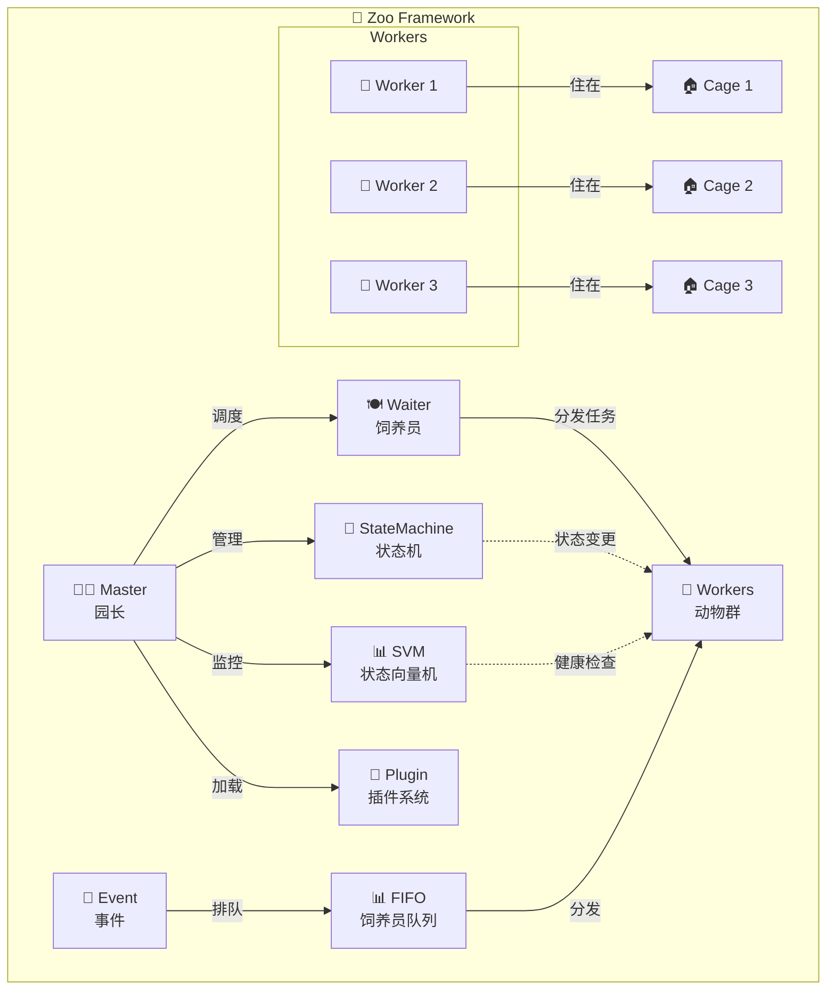

---

## 📦 核心模块

### 1. 👨‍🌾 Master - 园长

**职责**：管理整个框架的生命周期

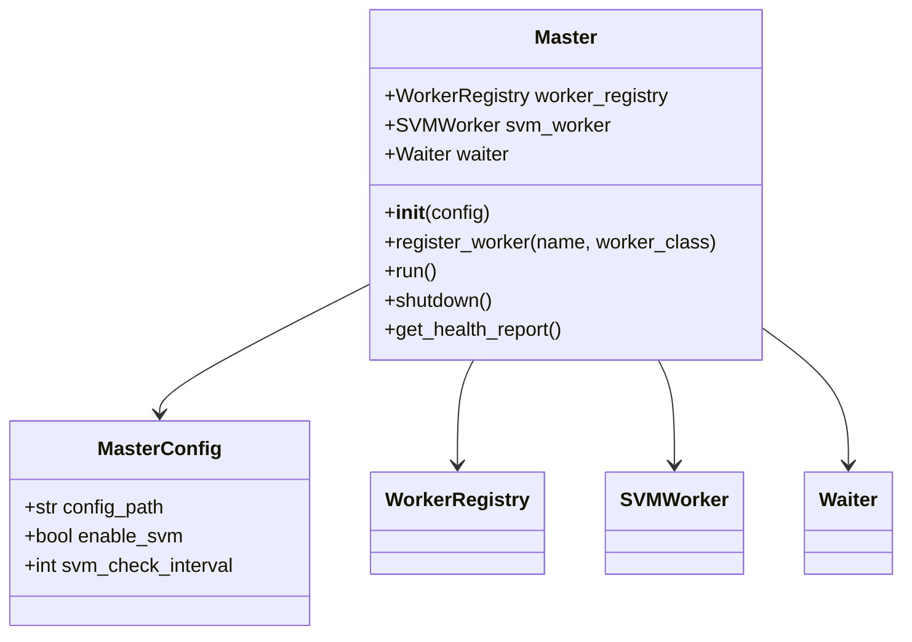

**关键特性**：
- Worker 自动注册和生命周期管理
- SVM 健康监控
- 优雅关闭

### 2. 👷 Worker - 动物

**职责**：执行业务逻辑的基本单元

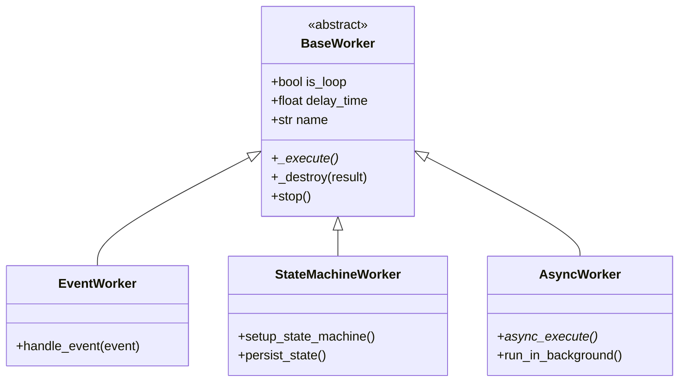

**Worker 类型**：
| 类型 | 说明 | 使用场景 |
|------|------|----------|
| BaseWorker | 基础 Worker | 简单任务 |
| EventWorker | 事件 Worker | 响应事件 |
| StateMachineWorker | 状态机 Worker | 状态管理 |
| AsyncWorker | 异步 Worker | IO 密集型任务 |

### 3. 🏠 Cage - 笼子

**职责**：提供线程安全和生命周期管理

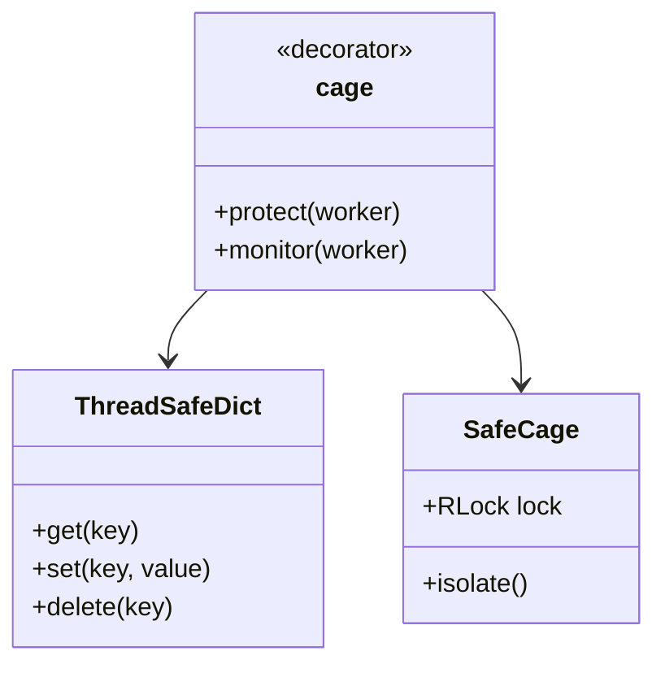

**保护机制**：
- 线程锁（RLock/Lock）
- 自动异常处理
- 资源清理

### 4. 🔄 StateMachine - 状态机

**职责**：管理应用状态

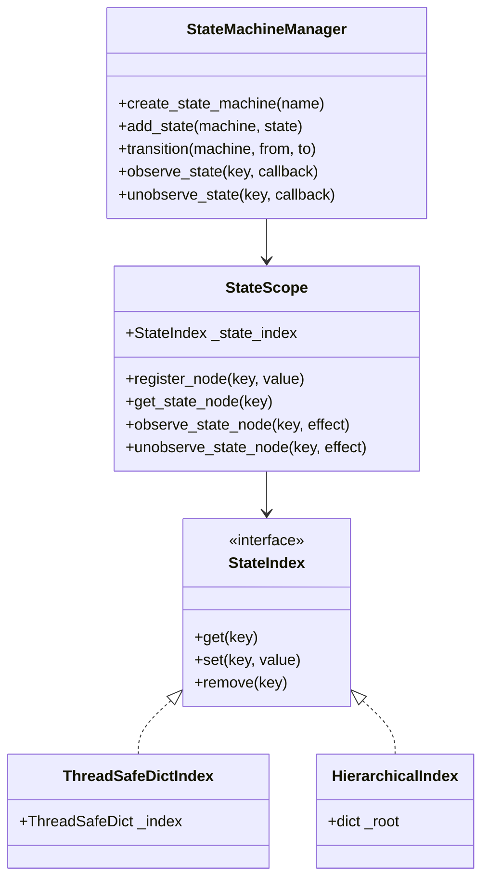

**P2 优化**：使用工厂模式创建索引，支持多种实现方式。

### 5. 📢 Event & Reactor - 事件系统

**职责**：Worker 间通信

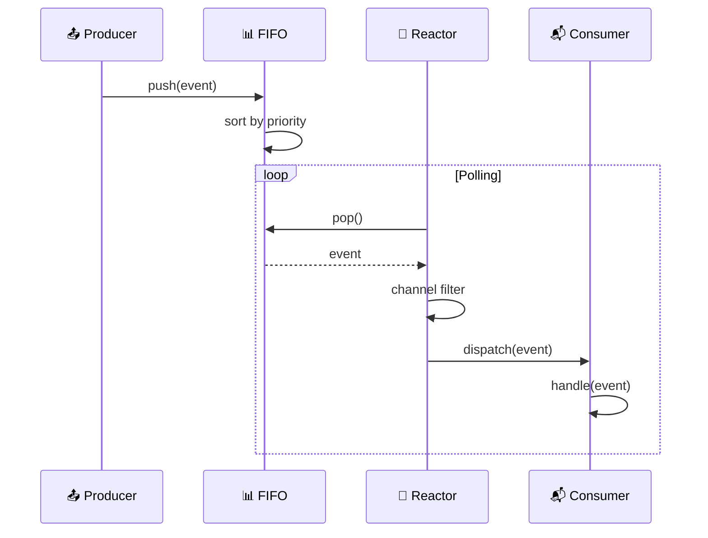

**P1 优化**：事件通道隔离，防止不同通道事件误处理。

### 6. 💾 PersistenceScheduler - 持久化调度器

**职责**：解耦持久化逻辑

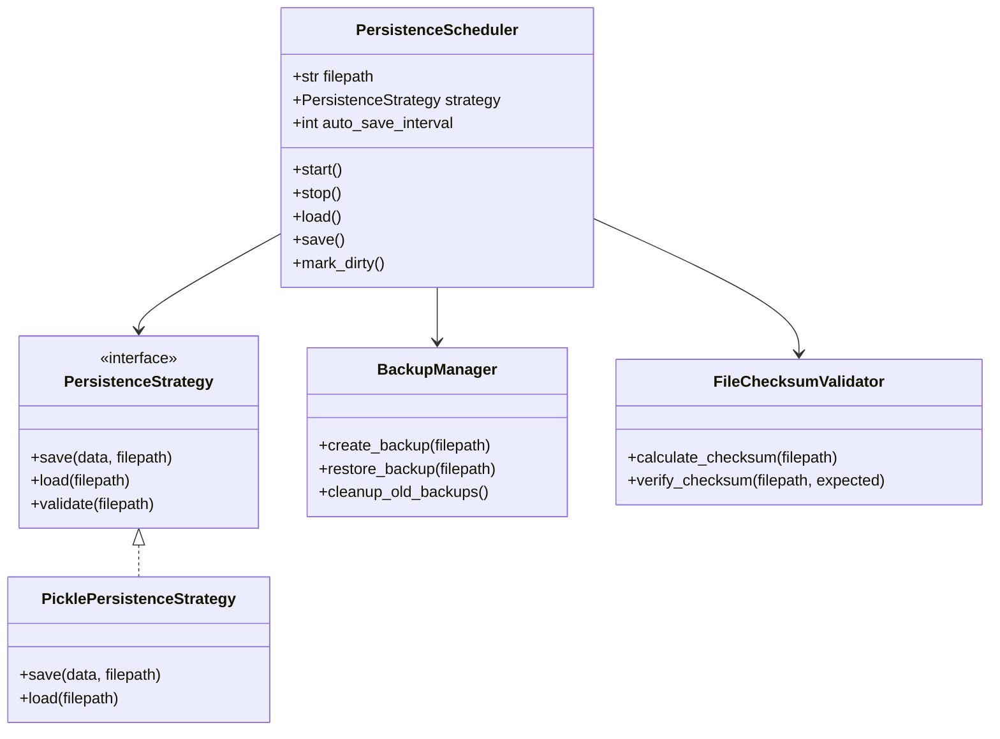

**P1 特性**：
- 解耦持久化逻辑
- 文件校验和
- 自动备份恢复

### 7. 🔌 Plugin - 插件系统

**职责**：支持第三方扩展

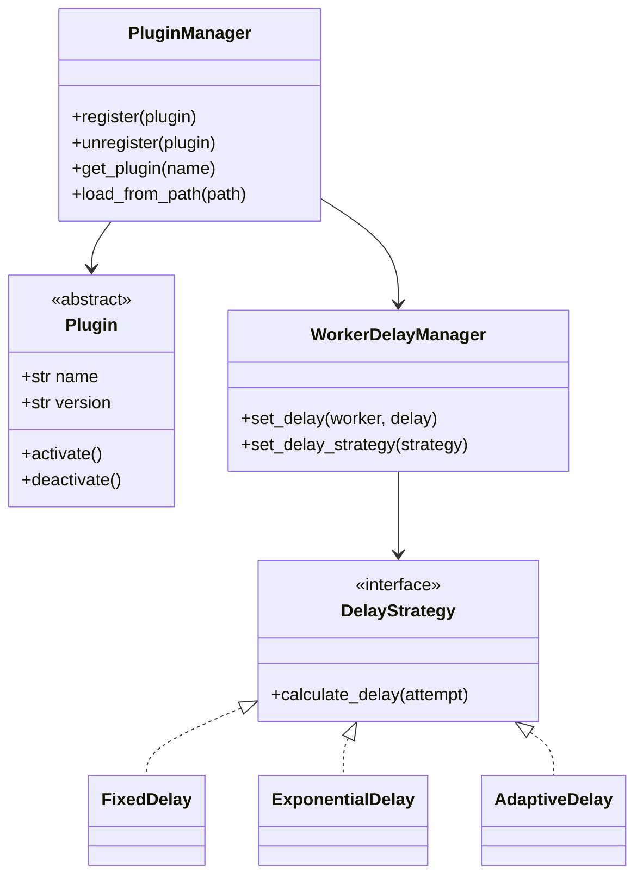

### 8. 📊 SVM - 状态向量机

**职责**：Worker 健康监控

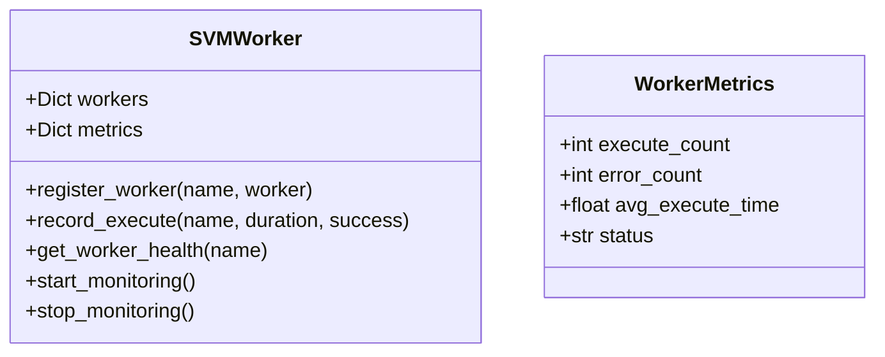

**监控指标**：
- 执行次数
- 错误率
- 平均执行时间
- 健康评分

---

## 🔄 数据流

### Worker 执行流程

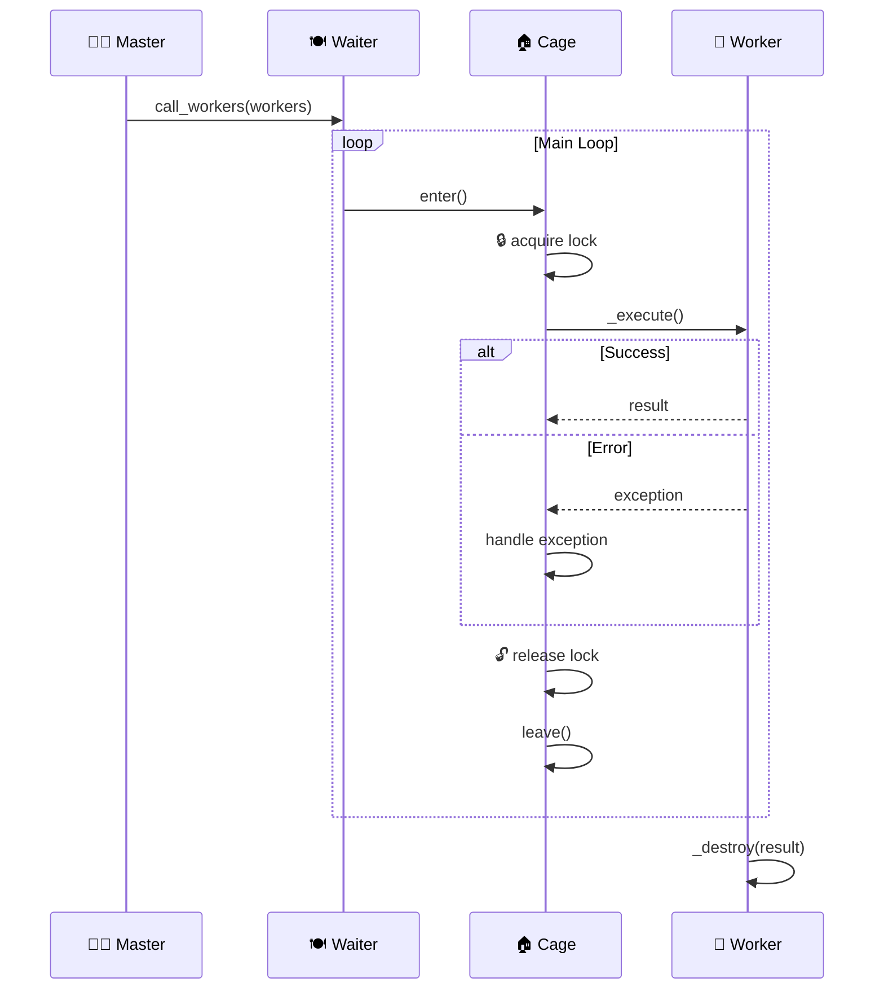

### 事件处理流程

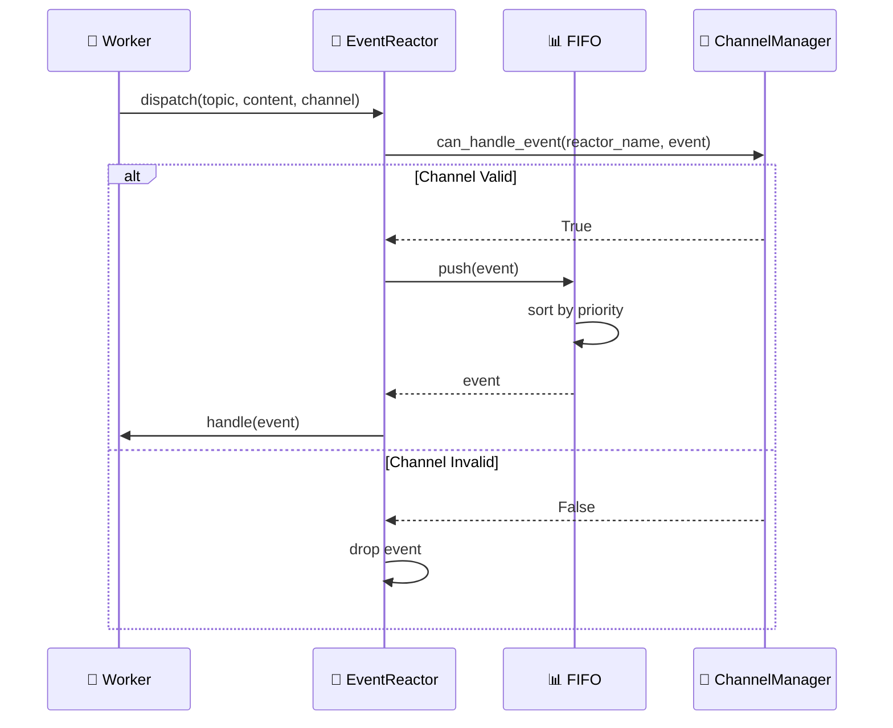

---

## 🛡️ 线程安全设计

### 线程安全组件

| 组件 | 线程安全机制 | 说明 |
|------|-------------|------|
| ThreadSafeDict | RLock | 线程安全字典 |
| Cage | RLock | Worker 保护 |
| StateScope | StateIndex | 状态隔离 |
| PersistenceScheduler | RLock | 文件操作安全 |

### 最佳实践

```python
# ✅ 使用 Cage 装饰器保护 Worker
from zoo_framework.core.aop import cage

@cage
class MyWorker(BaseWorker):
    pass

# ✅ 使用 ThreadSafeDict 存储共享数据
from zoo_framework.utils.thread_safe_dict import ThreadSafeDict

data = ThreadSafeDict()

# ✅ 使用 RLock 保护关键代码
import threading

_lock = threading.RLock()

with _lock:
    # 临界区代码
    pass
```

---

## 📈 性能优化

### P2 优化方案

1. **优先级算法优化**
   - 加权优先级：基础优先级 + 等待时间加成
   - 防止低优先级任务饿死

2. **异步 Worker**
   - 支持 asyncio 协程
   - Worker 池管理并发

3. **索引工厂模式**
   - 支持多种索引实现
   - 按需选择最优实现

---

## 🔗 模块依赖

```
zoo_framework/
├── core/
│   ├── master.py          → workers, statemachine, plugin
│   ├── waiter.py          → workers
│   ├── worker_registry.py → workers
│   └── persistence_scheduler.py → utils
├── workers/
│   ├── base_worker.py     → utils
│   ├── async_worker.py    → base_worker
│   └── state_machine_work.py → statemachine
├── statemachine/
│   ├── state_machine_manager.py → utils
│   ├── state_scope.py     → state_index_factory
│   └── state_index_factory.py → utils
├── fifo/
│   └── event_fifo.py      → utils
├── reactor/
│   ├── event_reactor.py   → utils
│   └── event_reactor_manager.py → event_reactor
└── plugin/
    └── __init__.py        → workers, utils
```

---

## 📚 相关文档

- [快速开始](DEVELOPMENT.md)
- [贡献指南](CONTRIBUTING.md)
- [调试技巧](DEBUGGING.md)
- [API 参考](API_REFERENCE.md)
