# 🏗️ 架构设计

本文档介绍 Zoo Framework 的整体架构设计，帮助开发者理解框架的工作原理。

---

## 🎯 设计哲学

Zoo Framework 采用**动物园隐喻**设计：

| 现实世界 | 框架概念 | 职责 |
|----------|----------|------|
| 👨‍🌾 园长 | Master | 管理整个动物园 |
| 🦁 动物 | Worker | 执行任务的基本单元 |
| 🏠 笼子 | ScopedContainer | 按作用域持有共享实例 |
| 🍎 食物 | Event | Worker 之间通信的载体 |
| 🥘 饲养员队列 | FIFO | 管理事件的有序处理 |

---

## 🏛️ 整体架构

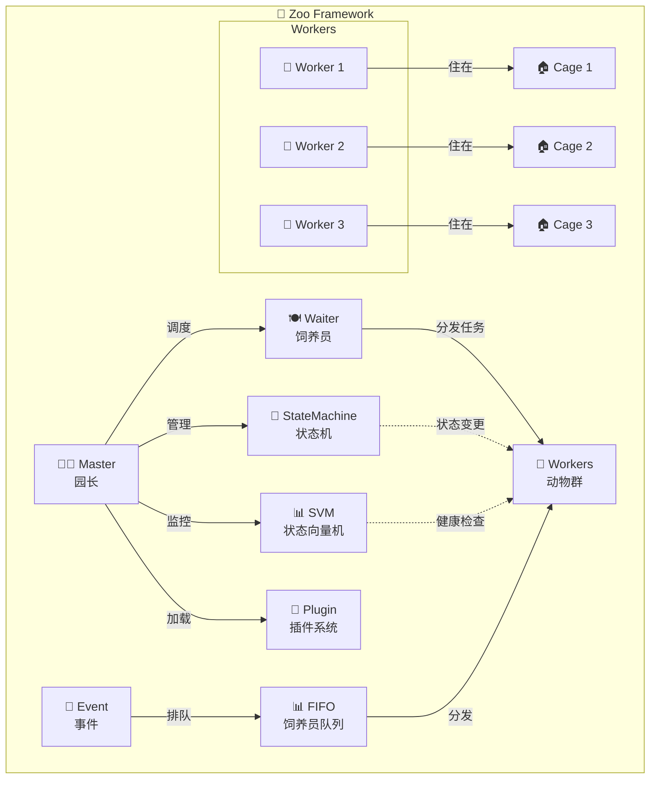
```mermaid
graph TB
    subgraph "🎪 Zoo Framework"
        M[👨‍🌾 Master<br/>园长] -->|调度| W[🍽️ Waiter<br/>饲养员]
        W -->|分发任务| Wr[👷 Workers<br/>动物群]

        subgraph Workers
            Wr1[🦁 Worker 1]
            Wr2[🐒 Worker 2]
            Wr3[🐘 Worker 3]
        end

        Wr1 -->|住在| C1[🏠 Cage 1]
        Wr2 -->|住在| C2[🏠 Cage 2]
        Wr3 -->|住在| C3[🏠 Cage 3]

        M -->|管理| SM[🔄 StateMachine<br/>状态机]
        M -->|监控| SVM[📊 SVM<br/>状态向量机]
        M -->|加载| PM[🔌 Plugin<br/>插件系统]

        E[📢 Event<br/>事件] -->|排队| F[📊 FIFO<br/>饲养员队列]
        F -->|分发| Wr

        SM -.->|状态变更| Wr
        SVM -.->|健康检查| Wr
    end
```

---

## 📦 核心模块

### 1. 👨‍🌾 Master - 园长

**职责**：管理整个框架的生命周期

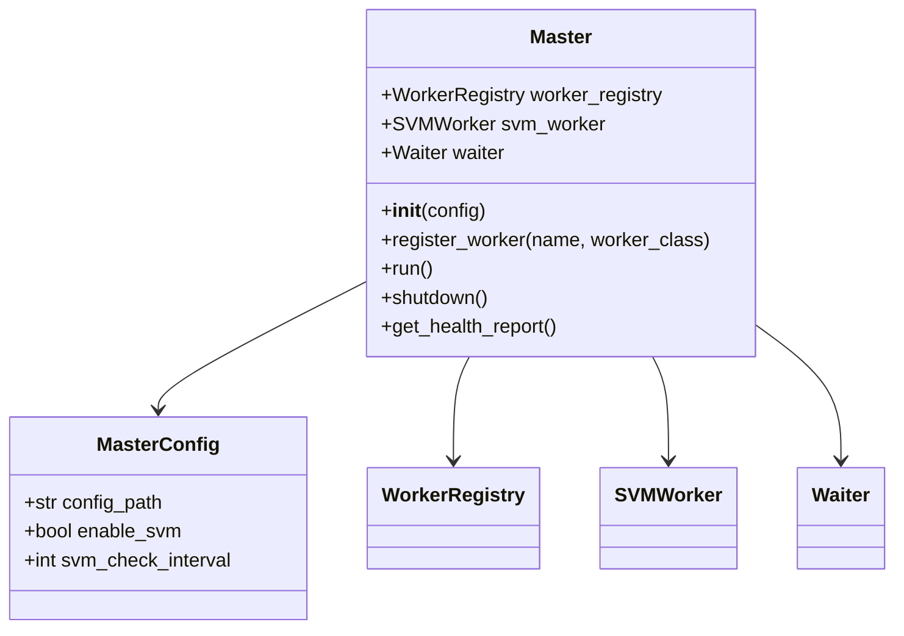
```mermaid
classDiagram
    class Master {
        +WorkerRegistry worker_registry
        +SVMWorker svm_worker
        +Waiter waiter
        +__init__(config)
        +register_worker(name, worker_class)
        +run()
        +shutdown()
        +get_health_report()
    }

    class MasterConfig {
        +str config_path
        +bool enable_svm
        +int svm_check_interval
    }

    Master --> MasterConfig
    Master --> WorkerRegistry
    Master --> SVMWorker
    Master --> Waiter
```

**关键特性**：
- Worker 自动注册和生命周期管理
- SVM 健康监控
- 优雅关闭

### 2. 👷 Worker - 动物

**职责**：执行业务逻辑的基本单元

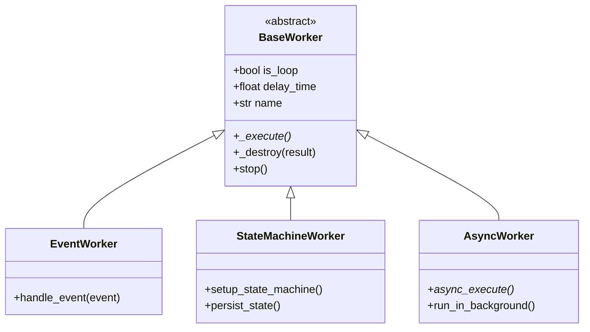
```mermaid
classDiagram
    class BaseWorker {
        <<abstract>>
        +bool is_loop
        +float delay_time
        +str name
        +_execute()*
        +_destroy(result)
        +stop()
    }

    class EventWorker {
        +handle_event(event)
    }

    class StateMachineWorker {
        +setup_state_machine()
        +persist_state()
    }

    class AsyncWorker {
        +async_execute()*
        +run_in_background()
    }

    BaseWorker <|-- EventWorker
    BaseWorker <|-- StateMachineWorker
    BaseWorker <|-- AsyncWorker
```

**Worker 类型**：
| 类型 | 说明 | 使用场景 |
|------|------|----------|
| BaseWorker | 基础 Worker | 简单任务 |
| EventWorker | 事件 Worker | 响应事件 |
| StateMachineWorker | 状态机 Worker | 状态管理 |
| AsyncWorker | 异步 Worker | IO 密集型任务 |

### 3. 🏠 Cage - 笼子

**对应组件**：`ScopedContainer`（`zoo_framework/core/container/`）
**职责**：按**作用域**持有共享实例——"跨 Worker 复用同一个对象"这件事的显式载体

三种作用域：进程级（全进程唯一）、会话级（每会话一个）、原型级（每次新建，不缓存）。

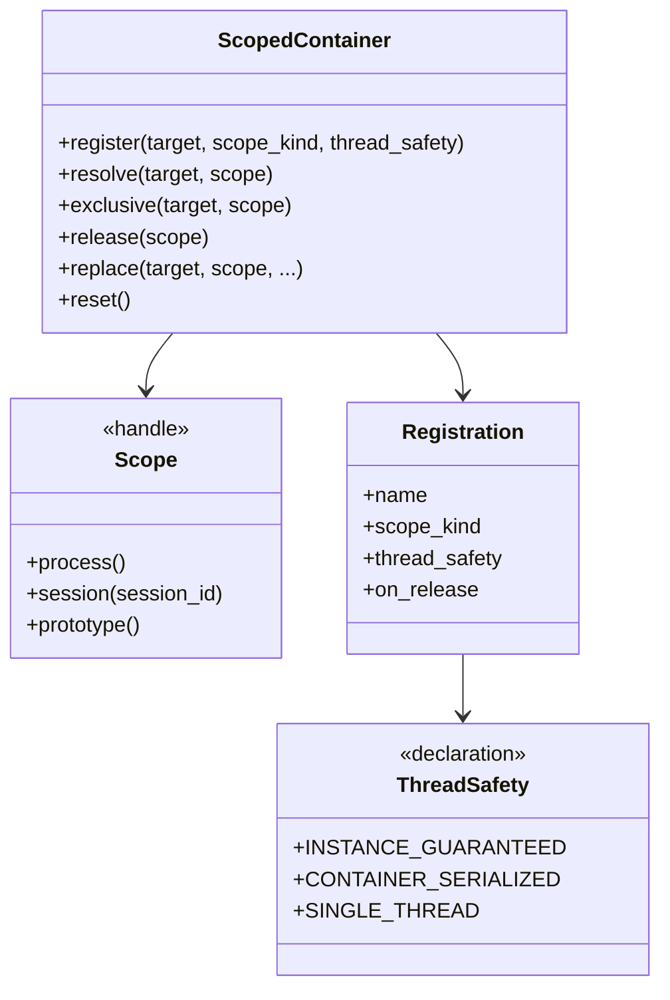
```mermaid
classDiagram
    class ScopedContainer {
        +register(target, scope_kind, thread_safety)
        +resolve(target, scope)
        +exclusive(target, scope)
        +release(scope)
        +replace(target, scope, ...)
        +reset()
    }

    class Scope {
        <<handle>>
        +process()
        +session(session_id)
        +prototype()
    }

    class Registration {
        +name
        +scope_kind
        +thread_safety
        +on_release
    }

    class ThreadSafety {
        <<declaration>>
        +INSTANCE_GUARANTEED
        +CONTAINER_SERIALIZED
        +SINGLE_THREAD
    }

    ScopedContainer --> Scope
    ScopedContainer --> Registration
    Registration --> ThreadSafety
```

**它保证什么**：解析以作用域为界（同作用域内同一注册项解析到同一实例、不同会话解析到不同
实例）；标识是**模块 + 限定名**（同名但定义位置不同的类不会串号）；解析**保留类型契约**
（容器不替换类，`isinstance` / `issubclass` 照常可用）；线程安全归属**必须显式声明**；生命
周期可显式释放（`release` 幂等，对每个实例只触发一次 `on_release`）；测试可 `replace` 注入
假实现、`reset` 回到初始状态。

**它不保证什么**——这条比上面那条更值得记住：**容器不是线程安全装饰器**。它不替实例加锁，
只按你**声明**的归属行事——`SINGLE_THREAD` 的项会被拒绝跨线程取用，`CONTAINER_SERIALIZED`
的项必须经 `exclusive()` 串行取用，而 `INSTANCE_GUARANTEED` 说的是"实例自己负责"。真正的
互斥仍来自 `ThreadSafeDict`、`RLock` 或实例自身。**声明必须如实**：把无锁的可变对象填成
`INSTANCE_GUARANTEED`，等于把一个未验证的安全假设写进代码。

> ⚠️ `@cage` 装饰器**已删除**。它过去声称"把类变成单例"，实际做的是**替换类**——`issubclass`
> / `isinstance` 双双失效（曾造成一次 P0），且两个同名类会按裸类名互相覆盖。框架内部的进程级
> 共享现由容器承担（`process_scoped` 装饰器，**不**替换类）。

### 4. 🔄 StateMachine - 状态机

**职责**：管理应用状态

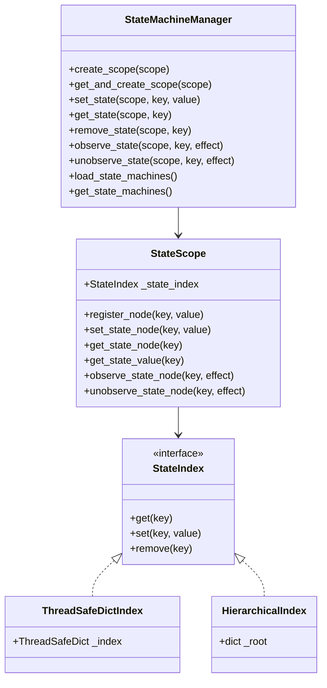
```mermaid
classDiagram
    class StateMachineManager {
        +create_scope(scope)
        +get_and_create_scope(scope)
        +set_state(scope, key, value)
        +get_state(scope, key)
        +remove_state(scope, key)
        +observe_state(scope, key, effect)
        +unobserve_state(scope, key, effect)
        +load_state_machines()
        +get_state_machines()
    }

    class StateScope {
        +StateIndex _state_index
        +register_node(key, value)
        +set_state_node(key, value)
        +get_state_node(key)
        +get_state_value(key)
        +observe_state_node(key, effect)
        +unobserve_state_node(key, effect)
    }

    class StateIndex {
        <<interface>>
        +get(key)
        +set(key, value)
        +remove(key)
    }

    class ThreadSafeDictIndex {
        +ThreadSafeDict _index
    }

    class HierarchicalIndex {
        +dict _root
    }

    StateMachineManager --> StateScope
    StateScope --> StateIndex
    StateIndex <|.. ThreadSafeDictIndex
    StateIndex <|.. HierarchicalIndex
```

**P2 优化**：使用工厂模式创建索引，支持多种实现方式。

### 5. 📢 Event & Reactor - 事件系统

**职责**：Worker 间通信

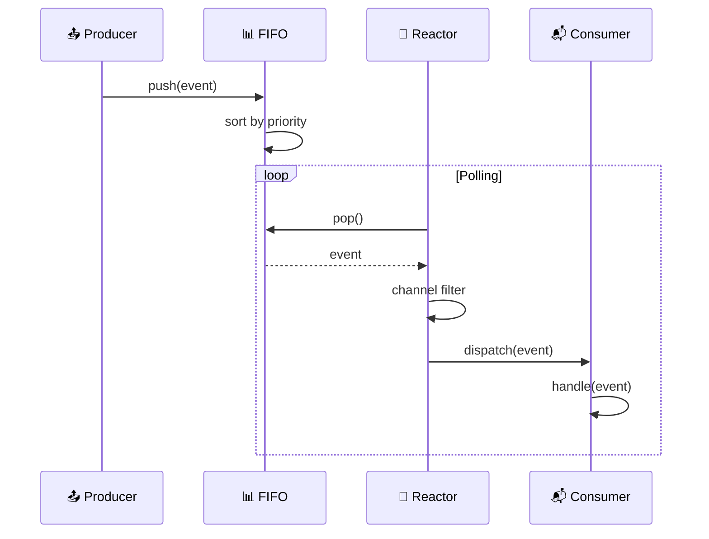
```mermaid
sequenceDiagram
    participant P as 📤 Producer
    participant F as 📊 FIFO
    participant R as 📢 Reactor
    participant C as 📬 Consumer

    P->>F: push(event)
    F->>F: sort by priority

    loop Polling
        R->>F: pop()
        F-->>R: event
        R->>R: channel filter
        R->>C: dispatch(event)
        C->>C: handle(event)
    end
```

**P1 优化**：事件通道隔离，防止不同通道事件误处理。

### 6. 💾 PersistenceScheduler - 持久化调度器

**职责**：解耦持久化逻辑

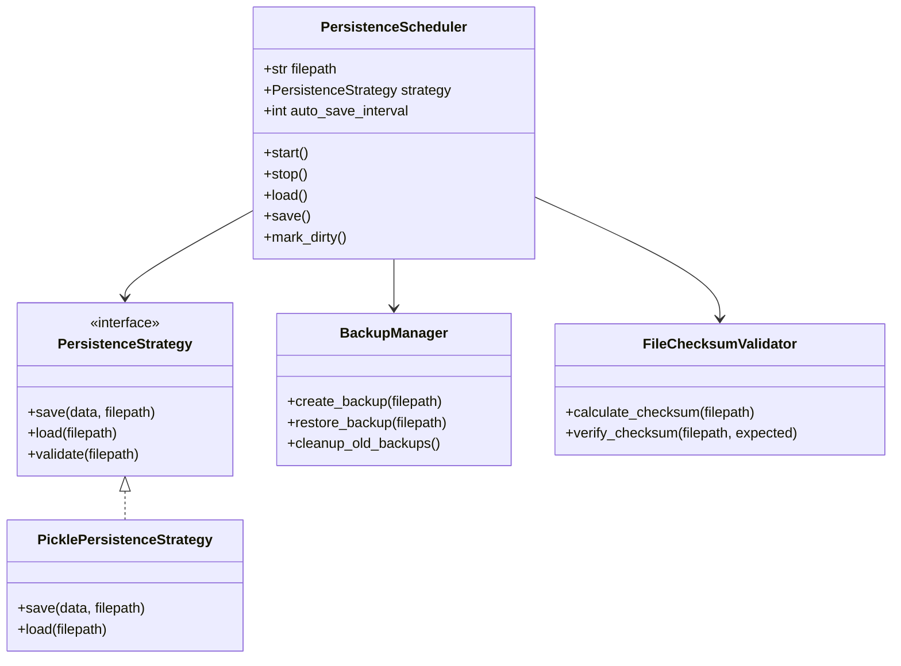
```mermaid
classDiagram
    class PersistenceScheduler {
        +str filepath
        +PersistenceStrategy strategy
        +int auto_save_interval
        +start()
        +stop()
        +load()
        +save()
        +mark_dirty()
    }

    class PersistenceStrategy {
        <<interface>>
        +save(data, filepath)
        +load(filepath)
        +validate(filepath)
    }

    class PicklePersistenceStrategy {
        +save(data, filepath)
        +load(filepath)
    }

    class BackupManager {
        +create_backup(filepath)
        +restore_backup(filepath)
        +cleanup_old_backups()
    }

    class FileChecksumValidator {
        +calculate_checksum(filepath)
        +verify_checksum(filepath, expected)
    }

    PersistenceScheduler --> PersistenceStrategy
    PersistenceScheduler --> BackupManager
    PersistenceScheduler --> FileChecksumValidator
    PersistenceStrategy <|.. PicklePersistenceStrategy
```

**P1 特性**：
- 解耦持久化逻辑
- 文件校验和
- 自动备份恢复

### 7. 🔌 Plugin - 插件系统

**职责**：支持第三方扩展

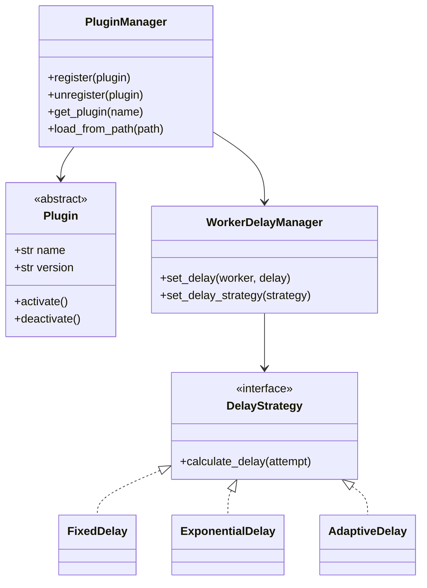
```mermaid
classDiagram
    class Plugin {
        <<abstract>>
        +str name
        +str version
        +activate()
        +deactivate()
    }

    class PluginManager {
        +register(plugin)
        +unregister(plugin)
        +get_plugin(name)
        +load_from_path(path)
    }

    class WorkerDelayManager {
        +set_delay(worker, delay)
        +set_delay_strategy(strategy)
    }

    class DelayStrategy {
        <<interface>>
        +calculate_delay(attempt)
    }

    class FixedDelay
    class ExponentialDelay
    class AdaptiveDelay

    PluginManager --> Plugin
    PluginManager --> WorkerDelayManager
    WorkerDelayManager --> DelayStrategy
    DelayStrategy <|.. FixedDelay
    DelayStrategy <|.. ExponentialDelay
    DelayStrategy <|.. AdaptiveDelay
```

### 8. 📊 SVM - 状态向量机

**职责**：Worker 健康监控

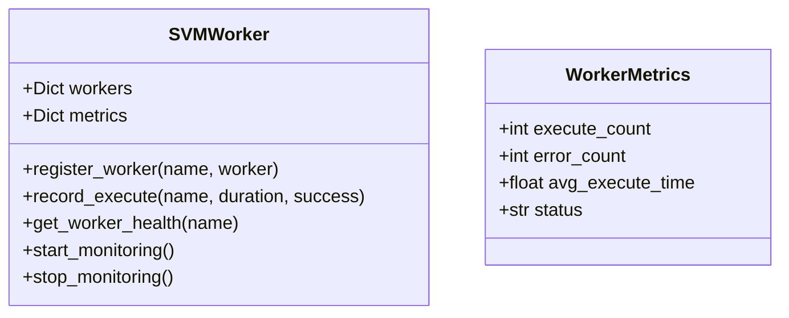
```mermaid
classDiagram
    class SVMWorker {
        +Dict workers
        +Dict metrics
        +register_worker(name, worker)
        +record_execute(name, duration, success)
        +get_worker_health(name)
        +start_monitoring()
        +stop_monitoring()
    }

    class WorkerMetrics {
        +int execute_count
        +int error_count
        +float avg_execute_time
        +str status
    }
```

**监控指标**：
- 执行次数
- 错误率
- 平均执行时间
- 健康评分

### 9. 🎯 自适应调度 - 双臂路由

**职责**：按 Worker 类在线学习「原生执行 / Python 执行」哪条更快，逐类选择

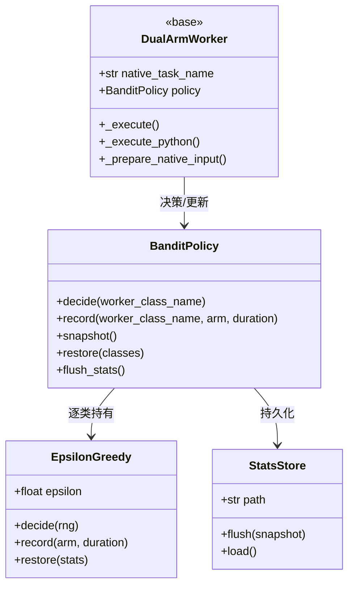
```mermaid
classDiagram
    class DualArmWorker {
        <<base>>
        +str native_task_name
        +BanditPolicy policy
        +_execute()
        +_execute_python()
        +_prepare_native_input()
    }

    class BanditPolicy {
        +decide(worker_class_name)
        +record(worker_class_name, arm, duration)
        +snapshot()
        +restore(classes)
        +flush_stats()
    }

    class EpsilonGreedy {
        +float epsilon
        +decide(rng)
        +record(arm, duration)
        +restore(stats)
    }

    class StatsStore {
        +str path
        +flush(snapshot)
        +load()
    }

    DualArmWorker --> BanditPolicy : 决策/更新
    BanditPolicy --> EpsilonGreedy : 逐类持有
    BanditPolicy --> StatsStore : 持久化
```

**工作方式**：
- 子类声明 python 执行体 `_execute_python()` 与可选的原生任务名 `native_task_name` 两条语义等价的臂
- 每次执行前 ε-greedy 决策走哪条臂，执行后以实测时长增量更新对应臂均值
- 决策与更新全部在 Worker 自身生命周期内闭环，调度内核零感知
- 关闭（`adaptive:enabled=false`，默认）时按纯 python 臂执行，不进分支、不取锁
- 显式拒绝：声明了原生臂但 `native:enabled=false` 或扩展缺失 → 构造期报错，不静默回退
- fail-open：决策/统计/持久化任何错误不传导为任务失败

### 10. 🦀 原生任务执行 - Rust 扩展接入

**职责**：Python 保留编排与生命周期，Rust 经显式适配层执行真实任务（首个任务：
Modbus RTU 响应帧解析）

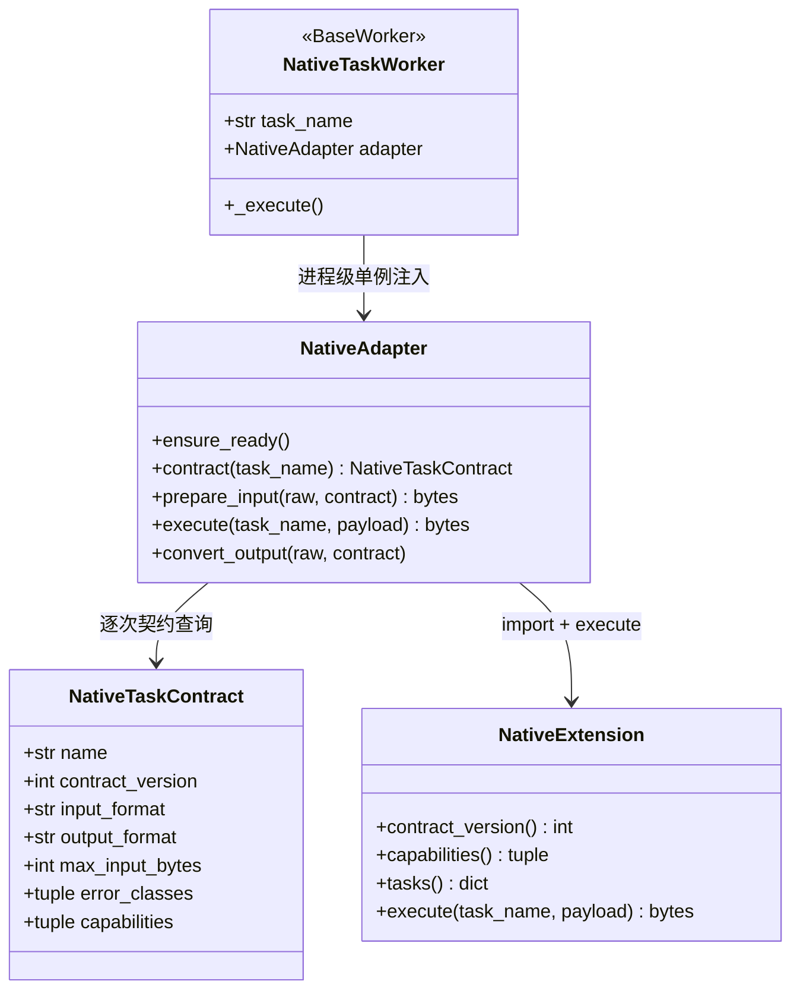
```mermaid
classDiagram
    class NativeTaskWorker {
        <<BaseWorker>>
        +str task_name
        +NativeAdapter adapter
        +_execute()
    }

    class NativeAdapter {
        +ensure_ready()
        +contract(task_name) NativeTaskContract
        +prepare_input(raw, contract) bytes
        +execute(task_name, payload) bytes
        +convert_output(raw, contract)
    }

    class NativeTaskContract {
        +str name
        +int contract_version
        +str input_format
        +str output_format
        +int max_input_bytes
        +tuple error_classes
        +tuple capabilities
    }

    class NativeExtension {
        +contract_version() int
        +capabilities() tuple
        +tasks() dict
        +execute(task_name, payload) bytes
    }

    NativeTaskWorker --> NativeAdapter : 进程级单例注入
    NativeAdapter --> NativeTaskContract : 逐次契约查询
    NativeAdapter --> NativeExtension : import + execute
```

**边界职责**：
- 适配器四职责：加载扩展 / 握手（`contract_version()` + `capabilities()` 与框架
  支持值比对）/ 边界转换（输入在边界一次性转入原生侧，执行体内保持原生数据）/
  错误映射（三族异常：`NativeInvalidInput` / `NativeTaskFailed` / `NativePanic`）
- 单一结算：结果只经既有 `run_and_settle → settle` 投递，适配器不投递、不碰
  run_id/session_id（运行标识由结算点按登记项盖章）
- GIL 释放：执行体经 `py.allow_threads` detach，不回调 Python——长任务期间控制
  线程照常推进（12 线程实测 ~7.5x 真实多核伸缩）
- 显式拒绝：扩展缺失 / 版本不匹配 / 能力不满足 / 任务未注册 / 输入超限 →
  执行前 `NativeInvalidInput`，无静默回退 Python 实现的路径
- 超时与停机沿用既有语义：超时只熔断（停止派发、上报不健康）不声称终止；
  停机后不接收新任务；停机幂等且等待有总预算上限
- 扩展为可选依赖：不随主包分发（源码 maturin 构建，模块名 `zoo_framework_native`），
  未安装时既有功能不受影响

**测量结论**（`native/DECISION.md` 阶段 0/2）：工作包络 = 帧 ≥8 寄存器（≥21 字节）
路由原生——125reg 大帧端到端 ~9.9x（12 线程吞吐 7.49x），1 寄存器小帧 1.07x
不过门槛、留 Python 侧；转换/编排占端到端 ~66%，是后续契约 v2 的优化候选。

---

## 🔄 数据流

### Worker 执行流程

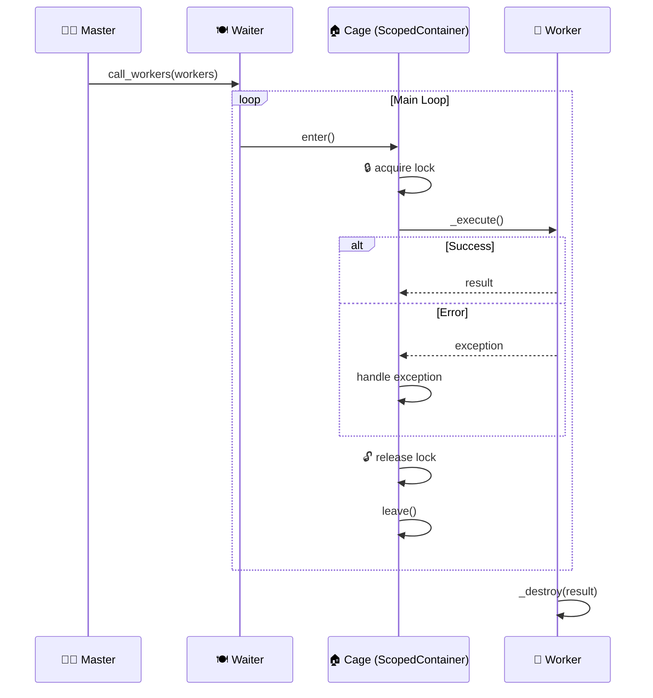
```mermaid
sequenceDiagram
    participant M as 👨‍🌾 Master
    participant W as 🍽️ Waiter
    participant C as 🏠 Cage (ScopedContainer)
    participant Wr as 👷 Worker

    M->>W: call_workers(workers)

    loop Main Loop
        W->>C: enter()
        C->>C: 🔒 acquire lock
        C->>Wr: _execute()

        alt Success
            Wr-->>C: result
        else Error
            Wr-->>C: exception
            C->>C: handle exception
        end

        C->>C: 🔓 release lock
        C->>C: leave()
    end

    Wr->>Wr: _destroy(result)
```

### 事件处理流程

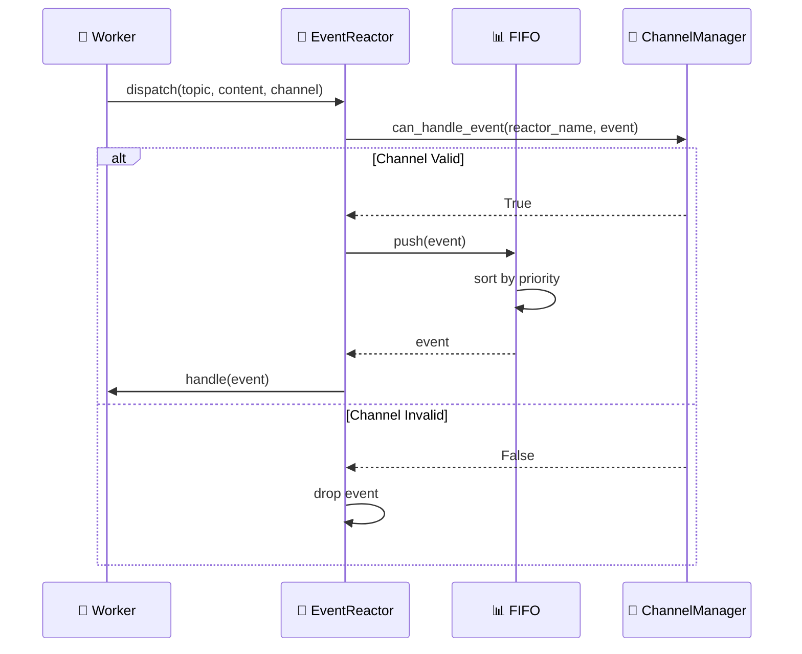
```mermaid
sequenceDiagram
    participant Wr as 👷 Worker
    participant E as 📢 EventReactor
    participant F as 📊 FIFO
    participant Ch as 📡 ChannelManager

    Wr->>E: dispatch(topic, content, channel)
    E->>Ch: can_handle_event(reactor_name, event)

    alt Channel Valid
        Ch-->>E: True
        E->>F: push(event)
        F->>F: sort by priority
        F-->>E: event
        E->>Wr: handle(event)
    else Channel Invalid
        Ch-->>E: False
        E->>E: drop event
    end
```

---

## 🛡️ 线程安全设计

### 线程安全组件

| 组件 | 线程安全机制 | 说明 |
|------|-------------|------|
| ThreadSafeDict | RLock | 线程安全字典 |
| ScopedContainer | 按注册项的锁 + `ThreadSafety` 声明 | 按作用域持有共享实例；**不替实例加锁** |
| StateScope | StateIndex | 状态隔离 |
| PersistenceScheduler | RLock | 文件操作安全 |
| EpsilonGreedy / BanditPolicy | Lock | 两臂统计读-改-写；`adaptive:enabled=false` 时不取锁 |

### 最佳实践

```python
# ✅ Worker 以类的形式注册——不要给它加任何"替换类"的装饰器
class MyWorker(BaseWorker):
    pass


# ✅ 跨 Worker 复用同一个对象：交给容器，并把作用域与线程安全归属写清
from zoo_framework.core.container import ScopeKind, ThreadSafety

container.register(
    MyClient, scope_kind=ScopeKind.SESSION, thread_safety=ThreadSafety.INSTANCE_GUARANTEED
)

# ✅ 使用 ThreadSafeDict 存储共享数据
from zoo_framework.utils.thread_safe_dict import ThreadSafeDict

data = ThreadSafeDict()

# ✅ 使用 RLock 保护关键代码
import threading

_lock = threading.RLock()

with _lock:
    # 临界区代码
    pass
```

---

## 📈 性能优化

### P2 优化方案

1. **优先级算法优化**
   - 加权优先级：基础优先级 + 等待时间加成
   - 防止低优先级任务饿死

2. **异步 Worker**
   - 支持 asyncio 协程
   - Worker 池管理并发

3. **索引工厂模式**
   - 支持多种索引实现
   - 按需选择最优实现

---

## 🔗 模块依赖

```
zoo_framework/
├── core/
│   ├── master.py          → workers, statemachine, plugin
│   ├── waiter.py          → workers
│   ├── worker_registry.py → workers
│   ├── persistence_scheduler.py → utils
│   └── adaptive/          → core.params_factory, utils（lazy import 纪律）
│       ├── bandit.py          （ε-greedy 两臂统计）
│       ├── policy.py          （逐类决策进程级单例）
│       └── stats_store.py     （统计持久化，默认关闭）
├── workers/
│   ├── base_worker.py     → utils
│   ├── async_worker.py    → base_worker
│   ├── dual_arm_worker.py → base_worker, core/adaptive
│   └── state_machine_work.py → statemachine
├── statemachine/
│   ├── state_machine_manager.py → utils
│   ├── state_scope.py     → state_index_factory
│   └── state_index_factory.py → utils
├── fifo/
│   └── event_fifo.py      → utils
├── reactor/
│   ├── event_reactor.py   → utils
│   └── event_reactor_manager.py → event_reactor
└── plugin/
    └── __init__.py        → workers, utils
```

---

## 📚 相关文档

- [快速开始](DEVELOPMENT.md)
- [贡献指南](CONTRIBUTING.md)
- [调试技巧](DEBUGGING.md)
- [API 参考](API_REFERENCE.md)
