# 🎪 Zoo Framework 开发文档

> Zoo Framework 是一个基于动物园隐喻的 Python 多线程框架，提供 Worker（动物）、Cage（笼子）、Master（园长）、Event（食物）、FIFO（饲养员队列）等核心概念。

---

## 📚 文档导航

| 文档 | 说明 | 目标读者 |
|------|------|----------|
| [📖 架构设计](ARCHITECTURE.md) | 框架整体架构、核心概念 | 所有开发者 |
| [🚀 快速开始](DEVELOPMENT.md) | 开发环境搭建、运行项目 | 新加入开发者 |
| [📝 贡献指南](CONTRIBUTING.md) | 代码规范、提交规范 | 贡献者 |
| [🐛 调试指南](DEBUGGING.md) | 常见问题排查、调试技巧 | 开发者 |
| [📊 API 参考](API_REFERENCE.md) | 核心 API 文档 | 开发者 |

---

## 🎯 项目概览

### 核心概念

```mermaid
graph TB
    subgraph 🎪 Zoo Framework
        M[👨‍🌾 Master 园长] -->|管理| W[🦁 Worker 动物]
        M -->|管理| C[🏠 Cage 笼子]
        M -->|管理| F[🥘 FIFO 饲养员队列]
        W -->|住在| C
        W -->|监听| E[🍎 Event 食物]
        E -->|排队| F
    end
```



### 技术栈

- **Python**: 3.8+
- **异步支持**: asyncio, gevent
- **代码质量**: Ruff, MyPy, pre-commit
- **测试**: pytest, pytest-cov, pytest-asyncio
- **CI/CD**: GitHub Actions

---

## 🚀 5 分钟快速开始

### 1. 克隆项目

```bash
git clone https://github.com/YearsAlso/zoo-framework.git
cd zoo-framework
```

### 2. 安装依赖

```bash
# 创建虚拟环境
python -m venv venv
source venv/bin/activate  # Linux/Mac
# 或: venv\Scripts\activate  # Windows

# 安装开发依赖
pip install -e ".[dev]"
```

### 3. 安装 pre-commit hooks

```bash
pre-commit install
```

### 4. 运行测试

```bash
pytest
```

### 5. 运行示例

```bash
python example/basic_usage.py
```

---

## 📁 项目结构

```
zoo-framework/
├── zoo_framework/          # 核心源码
│   ├── core/              # 核心模块
│   │   ├── master.py      # 👨‍🌾 园长（Master）
│   │   ├── waiter.py      # 🍽️ 饲养员（Waiter）
│   │   ├── persistence_scheduler.py  # 💾 持久化调度器
│   │   └── worker_registry.py        # 📝 Worker 注册表
│   ├── workers/           # 👷 Worker 实现
│   │   ├── base_worker.py # 基础 Worker
│   │   ├── event_worker.py
│   │   ├── state_machine_work.py
│   │   └── async_worker.py           # 🔄 异步 Worker
│   ├── statemachine/      # 🔄 状态机
│   │   ├── state_machine_manager.py
│   │   ├── state_scope.py
│   │   └── state_index_factory.py    # 🏭 索引工厂
│   ├── fifo/              # 📊 FIFO 队列
│   ├── reactor/           # 📢 事件响应器
│   │   ├── event_reactor_req.py      # 带通道隔离
│   │   └── event_reactor_manager.py
│   ├── plugin/            # 🔌 Plugin 系统
│   │   └── __init__.py    # PluginManager
│   └── utils/             # 🛠️ 工具类
│       ├── structured_log.py         # 📝 结构化日志
│       └── ...
├── tests/                 # 🧪 测试
├── example/               # 📚 示例代码
├── docs/                  # 📖 文档
├── pyproject.toml         # 📦 项目配置
└── requirements-dev.txt   # 🛠️ 开发依赖
```

---

## 🔑 核心模块详解

### 👨‍🌾 Master - 园长

Master 是框架的入口，负责管理所有 Worker 的生命周期。

```python
from zoo_framework.core import Master

# 创建 Master（自动初始化所有 Worker）
master = Master()

# 运行（阻塞）
master.run()

# 获取健康报告
report = master.get_health_report()
```

### 👷 Worker - 动物

Worker 是执行业务逻辑的基本单元。

```python
from zoo_framework.workers import BaseWorker

class MyWorker(BaseWorker):
    def __init__(self):
        super().__init__({
            "is_loop": True,    # 循环执行
            "delay_time": 1.0,  # 每秒执行一次
            "name": "MyWorker"
        })
    
    def _execute(self):
        print("执行业务逻辑")
```

### 🏠 Cage - 笼子

Cage 提供线程安全和生命周期管理。

```python
from zoo_framework.core.aop import cage

@cage  # 线程安全装饰器
class SafeWorker(BaseWorker):
    def _execute(self):
        # 线程安全的代码
        pass
```

---

## 🛠️ 开发工具

### 代码质量检查

```bash
# Ruff 代码检查
ruff check zoo_framework

# Ruff 自动修复
ruff check zoo_framework --fix

# Ruff 格式化
ruff format zoo_framework

# MyPy 类型检查
mypy zoo_framework
```

### 测试

```bash
# 运行所有测试
pytest

# 运行特定测试
pytest tests/test_worker.py

# 带覆盖率
pytest --cov=zoo_framework --cov-report=html

# 查看覆盖率报告
open htmlcov/index.html
```

### 安全扫描

```bash
# Bandit 安全扫描
bandit -r zoo_framework
```

---

## 📦 依赖管理

### 生产依赖

```toml
[project.dependencies]
click>=8.0.0
jinja2>=3.0.0
gevent>=23.0.0
pyyaml>=6.0
python-dotenv>=1.0.0
```

### 开发依赖

```bash
pip install -e ".[dev]"
```

包含：Ruff, MyPy, pytest, pre-commit, bandit 等

---

## 🔧 配置说明

### pyproject.toml 关键配置

```toml
[project]
name = "zoo-framework"
version = "0.5.1"
requires-python = ">=3.8"

[project.optional-dependencies]
dev = ["ruff", "mypy", "pytest", ...]
docs = ["mkdocs", ...]

[tool.ruff]
target-version = "py38"
line-length = 100

[tool.mypy]
python_version = "3.8"
```

---

## 🌟 特性清单

### P0 - 必须修复 ✅

- [x] Plugin 系统实现
- [x] Worker 延迟管理
- [x] 线程安全修复
- [x] 内存泄漏修复

### P1 - 重要功能 ✅

- [x] SVM Worker 状态向量机
- [x] 持久化逻辑解耦
- [x] 文件校验和备份
- [x] 事件通道隔离

### P2 - 优化项 ✅

- [x] 优先级算法优化
- [x] Master 参数优化
- [x] Worker 注册机制重构
- [x] 状态机索引工厂模式

### 8 个优化方案 ✅

- [x] 现代打包工具 (pyproject.toml)
- [x] 代码质量工具 (Ruff/MyPy)
- [x] 测试覆盖
- [x] CI/CD 增强
- [x] Worker 注册重构
- [x] Plugin 系统
- [x] 结构化日志
- [x] 异步 IO 优化

---

## 📞 获取帮助

- 📖 [完整文档](https://yearsalso.github.io/zoo-framework/)
- 🐛 [Issue Tracker](https://github.com/YearsAlso/zoo-framework/issues)
- 💬 [Discussions](https://github.com/YearsAlso/zoo-framework/discussions)

---

## 📄 许可证

Apache License 2.0 © XiangMeng
